# System Architecture

## 1. Architecture Overview

### 1.1 High-Level Architecture Diagram

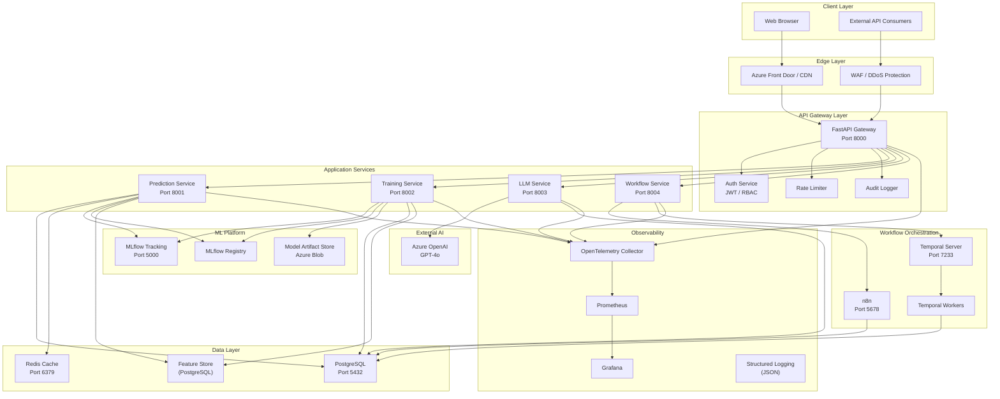

### 1.2 Request Flow Diagram

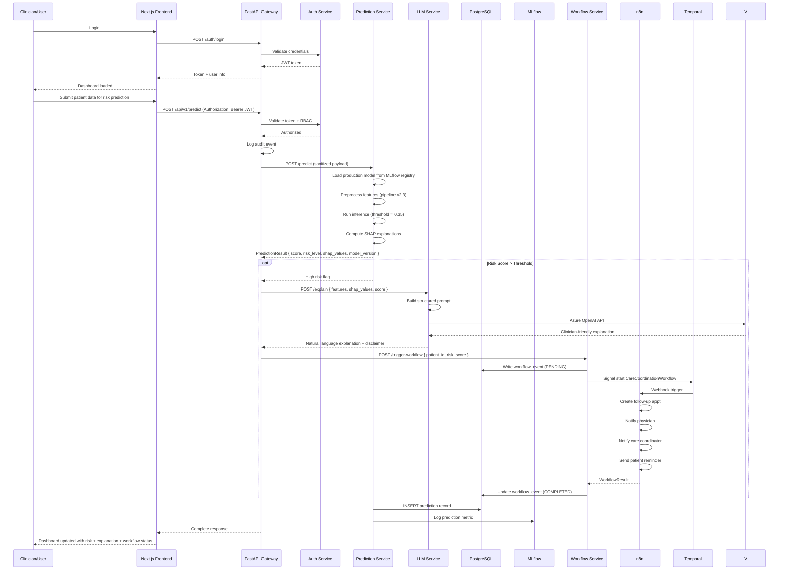

### 1.3 ML Lifecycle Flow

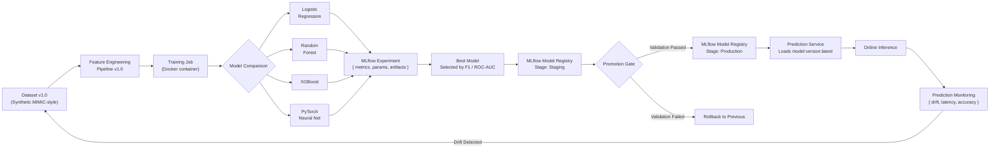

## 2. Service Specifications

### 2.1 Frontend Application (Next.js)

**Port:** 3000
**Tech:** Next.js 14, React 18, TypeScript, Tailwind CSS, NextAuth.js, Recharts, React Query

**Routes:**

| Route | Method | Description |
|-------|--------|-------------|
| `/` | GET | Landing / login redirect |
| `/dashboard` | GET | Main dashboard with KPIs |
| `/patients` | GET | Patient list with search |
| `/patients/[id]` | GET | Patient detail + risk + explanation |
| `/patients/[id]/predict` | POST | Trigger prediction |
| `/experiments` | GET | MLflow experiment list |
| `/experiments/[id]` | GET | Single experiment details |
| `/models` | GET | Model registry browser |
| `/models/compare` | GET | Model comparison view |
| `/workflows` | GET | Workflow history and status |
| `/workflows/[id]` | GET | Single workflow detail |
| `/monitoring` | GET | Prediction monitoring dashboard |
| `/admin` | GET | Admin panel (RBAC restricted) |

**Key Components:**

- `PredictionPanel` — Displays risk score with gauge + model version + confidence
- `ShapForcePlot` — Interactive SHAP waterfall/summary plot (React + D3)
- `ModelComparisonChart` — Side-by-side metric comparison
- `WorkflowTimeline` — Visual workflow execution trace
- `ExperimentTable` — Paginated MLflow experiment list with search/filter
- `AuditLogTable` — Searchable audit log viewer (admin only)

**State Management:**

- Server state: React Query (TanStack Query) with stale-while-revalidate
- Client state: React Context for auth, local state for UI
- Real-time: Server-Sent Events for workflow status updates

### 2.2 API Gateway (FastAPI)

**Port:** 8000
**Tech:** FastAPI, Pydantic v2, PyJWT, Prometheus client, structlog

**Middleware Stack (order):**

```
1. HTTPS Redirect (production)
2. CORS (configured per environment)
3. Request ID (UUID v4 per request)
4. Structured Logging (structlog, JSON output)
5. Rate Limiting (token bucket, per-user per-endpoint)
6. JWT Authentication (Bearer token validation)
7. RBAC Authorization (role → permission → resource)
8. Request Validation (Pydantic models)
9. Audit Logging (async write to PostgreSQL)
10. Latency Tracking (OpenTelemetry span)
11. Response Compression (gzip/brotli)
```

**Rate Limits:**

| Endpoint Group | Rate |
|----------------|------|
| Auth endpoints | 10/min per IP |
| Prediction API | 100/min per user |
| Training API | 5/min per user (long-running) |
| Workflow queries | 200/min per user |
| Admin endpoints | 50/min per user |
| Read-only endpoints | 500/min per user |

**Error Response Format:**

```json
{
    "error": {
        "code": "INVALID_PATIENT_DATA",
        "message": "Missing required field: age",
        "details": {
            "field": "age",
            "reason": "required",
            "schema_path": "$.patient.age"
        },
        "request_id": "a1b2c3d4-e5f6-7890-abcd-ef1234567890",
        "timestamp": "2026-07-15T14:30:00Z"
    }
}
```

### 2.3 Prediction Service

**Port:** 8001
**Tech:** FastAPI, PyTorch, Scikit-learn, SHAP, Pandas, NumPy, MLflow client

**Architecture:**

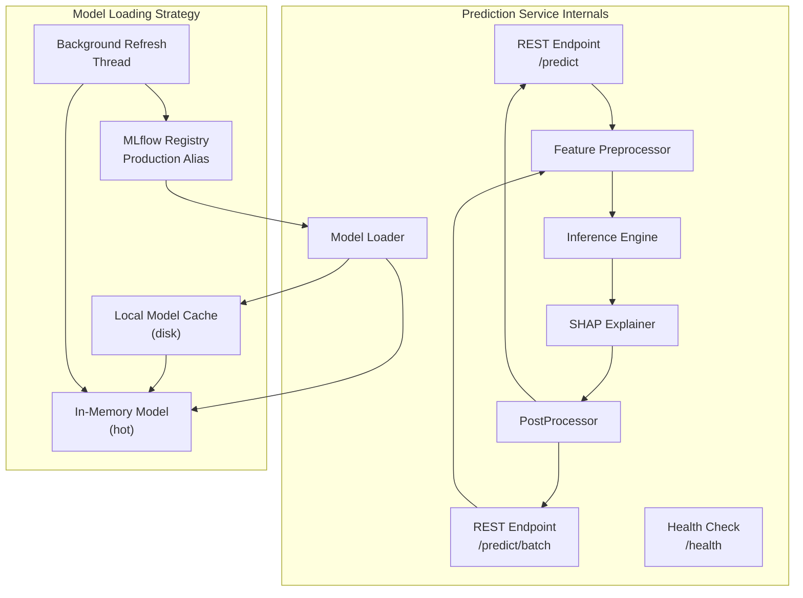

**Model Loading Strategy:**

- On startup: load production model from MLflow registry → cache locally → load into memory
- Background thread: polls MLflow registry every 60s for new production model version
- On update: hot-reloads new model without dropping in-flight requests (readers-writer lock)
- Fallback: if registry is unreachable, serve last cached model; log warning
- Cold start: ~2 seconds (download model + load + compile SHAP explainer)

**Prediction Response Schema:**

```json
{
    "prediction": {
        "risk_score": 0.72,
        "risk_level": "HIGH",
        "confidence": 0.89,
        "threshold": 0.35,
        "model_version": "3.2.1",
        "model_name": "xgboost-readmission-v3",
        "prediction_id": "pred_abc123",
        "timestamp": "2026-07-15T14:30:00.123Z",
        "latency_ms": 142
    },
    "features": {
        "age": 72,
        "previous_admissions": 3,
        "comorbidity_score": 7.5,
        "lab_result_abnormal": 1,
        "medication_count": 8,
        "length_of_stay_days": 14
    },
    "explanation": {
        "shap_values": {
            "age": 0.15,
            "previous_admissions": 0.22,
            "comorbidity_score": 0.18,
            "lab_result_abnormal": 0.09,
            "medication_count": 0.05,
            "length_of_stay_days": 0.03
        },
        "base_value": 0.28,
        "top_features": [
            {
                "feature": "previous_admissions",
                "value": 3,
                "shap_value": 0.22,
                "contribution": "increases_risk"
            },
            {
                "feature": "comorbidity_score",
                "value": 7.5,
                "shap_value": 0.18,
                "contribution": "increases_risk"
            },
            {
                "feature": "age",
                "value": 72,
                "shap_value": 0.15,
                "contribution": "increases_risk"
            }
        ]
    },
    "llm_explanation": {
        "summary": "This patient has significantly elevated readmission risk primarily driven by 3 prior admissions in 6 months and a high comorbidity burden. Close follow-up within 48 hours is recommended.",
        "disclaimer": "This explanation is generated by AI for decision support only. It does not constitute a clinical diagnosis or medical advice. All outputs should be reviewed by a qualified healthcare professional.",
        "generated_at": "2026-07-15T14:30:01.456Z"
    },
    "workflow": {
        "triggered": true,
        "workflow_id": "wf_xyz789",
        "workflow_type": "care_coordination",
        "status": "pending",
        "tracking_url": "/workflows/wf_xyz789"
    }
}
```

### 2.4 Training Service

**Port:** 8002
**Tech:** FastAPI, PyTorch, Scikit-learn, XGBoost, Optuna, Pandas, NumPy, MLflow client

**Training Pipeline Architecture:**

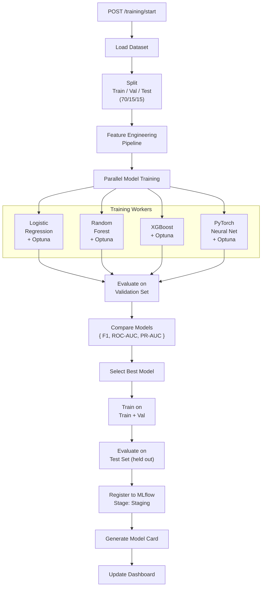

**Hyperparameter Search Spaces:**

| Model | Parameters | Search Method | Trials |
|-------|-----------|---------------|--------|
| Logistic Regression | C, penalty, solver, max_iter | Grid Search | 24 |
| Random Forest | n_estimators, max_depth, min_samples_split, min_samples_leaf, max_features | Optuna (TPE) | 50 |
| XGBoost | learning_rate, max_depth, n_estimators, subsample, colsample_bytree, gamma, reg_alpha, reg_lambda | Optuna (TPE) | 80 |
| PyTorch NN | n_layers, hidden_dim, dropout, learning_rate, batch_size, weight_decay | Optuna (TPE) | 60 |

**Cross-Validation Strategy:**

- 5-fold stratified cross-validation (preserves class distribution)
- Temporal holdout: last N months as validation (prevents data leakage from future)
- Multiple random seed trials (seeds 42, 123, 2024) for robustness

**Dataset Versioning:**

Each training run records:
- Dataset hash (SHA-256 of feature matrix + targets)
- Dataset version tag (from MLflow dataset tracking)
- Feature pipeline version
- Source data timestamps
- Train/val/test split indices

### 2.5 LLM Service

**Port:** 8003
**Tech:** FastAPI, OpenAI Python SDK, Pydantic, tiktoken

**Architecture:**

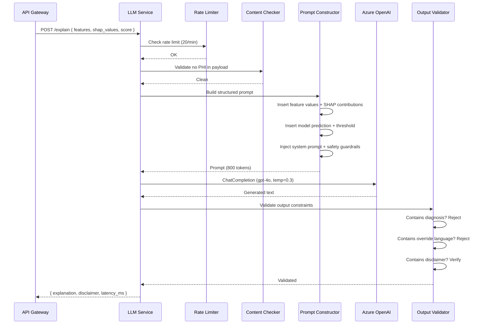

**Prompt Template Architecture:**

```
System:
You are a clinical decision support assistant. You receive structured model output
and explain it in clinician-friendly language. You NEVER diagnose, NEVER recommend
specific treatments, and NEVER override the risk score. You always include the
disclaimer that this is AI-generated decision support only.

Context:
- Model: {model_name} v{version}
- Risk score: {score} ({risk_level})
- Threshold: {threshold}
- Top contributing factors: {top_features}

Feature Data:
{feature_table}

Patient Context:
- Age: {age}
- Previous admissions (6mo): {previous_admissions}
- Primary diagnosis: {primary_diagnosis}

Instructions:
1. Summarize the readmission risk level in one sentence.
2. Explain the top 3-4 contributing factors in plain clinical language.
3. Suggest general monitoring considerations (no specific treatments).
4. End with the exact disclaimer text.

Output Format (JSON):
{
    "summary": "...",
    "contributing_factors": [{ "factor": "...", "explanation": "..." }],
    "monitoring_suggestions": ["..."],
    "disclaimer": "..."
}

Disclaimer: "This analysis is AI-generated decision support only. It does not
constitute a clinical diagnosis, medical advice, or a substitute for professional
clinical judgment. All AI-generated outputs must be reviewed by a qualified
healthcare professional before any clinical action is taken."
```

**Safety Guards:**

- Input: PHI regex scanner rejects known PHI patterns (MRNs, SSNs, DOBs)
- Input: Token limit (2048 max), prompt injection detection via delimiters
- Inference: Temperature 0.3 for reproducibility; max_tokens 1024
- Output: Regex validator rejects any diagnosis statements ("patient has X")
- Output: Validator checks for mandatory disclaimer inclusion
- Output: If quality < 0.8 (via embedding similarity to expected form), fallback to template-based explanation
- Latency target: < 3s p95
- Rate limit: 20 requests/minute per user, 100/minute overall

### 2.6 Workflow Service

**Port:** 8004
**Tech:** FastAPI, Temporal Python SDK, n8n webhook client, PostgreSQL

**Dual orchestration design:**

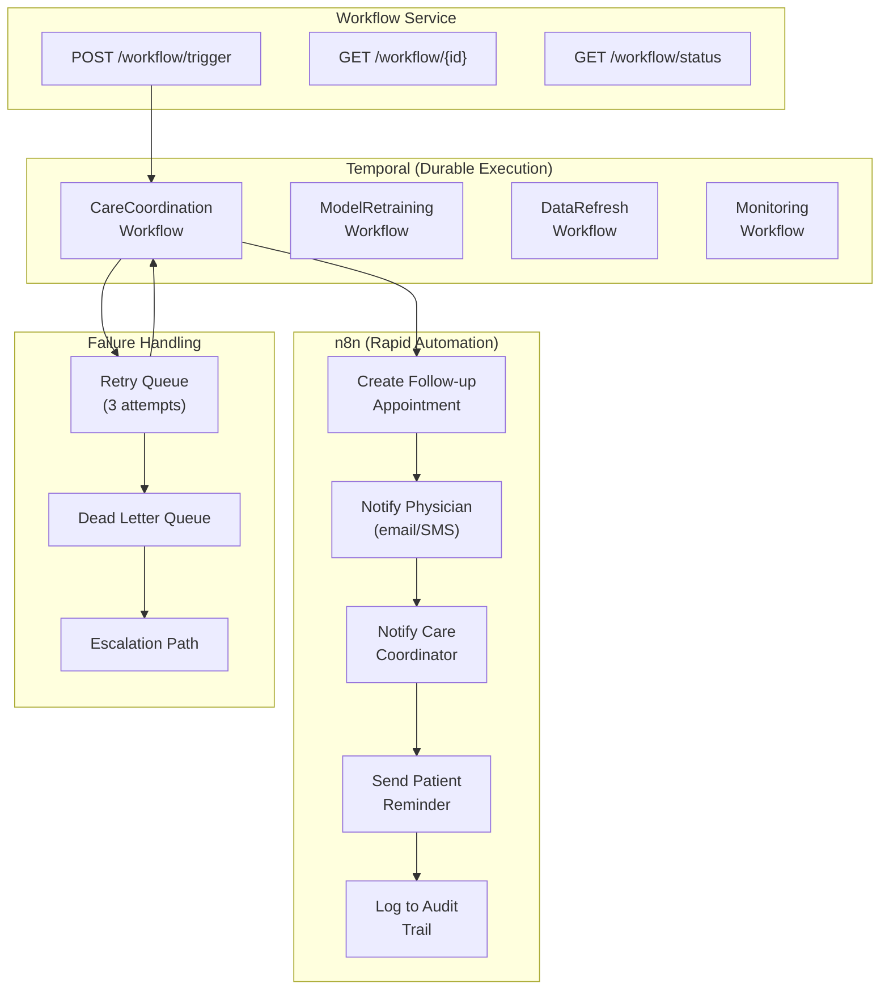

**Temporal Workflow: Care Coordination**

```python
# Pseudocode — the actual durable workflow
async def CareCoordinationWorkflow(ctx: WorkflowContext, patient_id: str, risk_score: float):
    # Step 1: Check for existing active care plan
    existing = await lookup_active_care_plan(patient_id)
    if existing:
        return {"skipped": True, "reason": "Active care plan exists"}

    # Step 2: Create care episode
    episode_id = await create_care_episode(patient_id, risk_score)

    # Step 3: Execute n8n workflows with compensation
    notification_result = await execute_activity(
        NotifyCareTeam,
        args=[patient_id, risk_score, episode_id],
        retry_policy={"max_retries": 3, "backoff": "exponential"},
        compensation=delete_notification
    )

    # Step 4: Schedule follow-up (with Temporal timer)
    await asyncio.sleep(3600)  # 1-hour delay for scheduling
    schedule_result = await execute_activity(
        ScheduleFollowUp,
        args=[patient_id, episode_id],
        retry_policy={"max_retries": 3}
    )

    # Step 5: Monitor adherence (child workflow)
    child = await start_child_workflow(
        MonitorAdherenceWorkflow,
        args=[patient_id, episode_id],
        execution_timeout="30 days"
    )

    return {"episode_id": episode_id, "status": "ACTIVE"}
```

**n8n Workflow: Care Coordination Automation**

```json
{
    "name": "High Risk Care Coordination",
    "trigger": "webhook",
    "steps": [
        {
            "id": 1,
            "node": "Webhook Receiver",
            "parameters": {
                "path": "care-coordination-trigger"
            }
        },
        {
            "id": 2,
            "node": "HTTP Request",
            "name": "Get Patient Details",
            "parameters": {
                "url": "http://api-gateway:8000/api/v1/patients/{{$json.patient_id}}",
                "method": "GET"
            }
        },
        {
            "id": 3,
            "node": "IF",
            "name": "Check Risk Level",
            "parameters": {
                "conditions": {
                    "string": [
                        { "value1": "={{$json.risk_level}}", "operation": "equal", "value2": "HIGH" }
                    ]
                }
            }
        },
        {
            "id": 4,
            "node": "Gmail",
            "name": "Notify Physician",
            "parameters": {
                "to": "={{$json.physician_email}}",
                "subject": "High Readmission Risk Alert - Patient {{$json.patient_name}}",
                "html": "<p>Patient <b>{{$json.patient_name}}</b> (MRN: {{$json.mrn}}) has been identified with <b>{{$json.risk_level}}</b> readmission risk.</p><p>Risk Score: {{$json.risk_score}}</p><p>A follow-up appointment has been scheduled.</p>"
            }
        },
        {
            "id": 5,
            "node": "Gmail",
            "name": "Notify Care Coordinator",
            "parameters": {
                "to": "={{$json.coordinator_email}}",
                "subject": "Care Coordination Required - Patient {{$json.patient_name}}"
            }
        },
        {
            "id": 6,
            "node": "Twilio",
            "name": "Send Patient SMS Reminder",
            "parameters": {
                "to": "={{$json.patient_phone}}",
                "message": "Your follow-up appointment has been scheduled for {{$json.appointment_date}}. Please call (555) 123-4567 to confirm or reschedule."
            }
        },
        {
            "id": 7,
            "node": "PostgreSQL",
            "name": "Log Workflow Event",
            "parameters": {
                "query": "INSERT INTO workflow_events (patient_id, workflow_type, status, triggered_at) VALUES ($1, 'care_coordination', 'COMPLETED', NOW())",
                "params": ["={{$json.patient_id}}"]
            }
        },
        {
            "id": 8,
            "node": "HTTP Request",
            "name": "Update Dashboard",
            "parameters": {
                "url": "http://api-gateway:8000/api/v1/workflows/events",
                "method": "POST",
                "body": {
                    "patient_id": "={{$json.patient_id}}",
                    "event_type": "care_coordination_triggered",
                    "status": "completed"
                }
            }
        }
    ]
}
```

### 2.7 PostgreSQL Database

**Connection:** Shared across services (service-specific roles with least-privilege)

**Schema overview:** See [DATA_MODEL.md](DATA_MODEL.md) for complete ER diagram and DDL.

**Table Summaries:**

| Table | Purpose | Estimated Rows | Growth Rate |
|-------|---------|---------------|-------------|
| `users` | Auth + RBAC | 1K | Low |
| `patients` | Patient records (synthetic) | 100K | Medium |
| `predictions` | Inference results | 10M | High |
| `workflow_events` | Workflow state machine | 5M | High |
| `model_versions` | Registry mirror | 100 | Low |
| `experiments` | MLflow experiment cache | 1K | Low |
| `audit_logs` | Access records | 50M | Very High |
| `feature_store` | Precomputed features | 1M | Medium |

**Indexing Strategy:**

- B-tree on all FK columns
- Partial index on predictions: `WHERE risk_level = 'HIGH'` for dashboard queries
- Composite index on audit_logs: `(user_id, created_at DESC)` for audit queries
- BRIN index on time-series tables (workflow_events, predictions) for range scans
- GIN index on JSONB columns where applicable

**Partitioning Strategy:**

- `predictions`: Range-partitioned by month (prediction_timestamp)
- `audit_logs`: Range-partitioned by month (created_at)
- `workflow_events`: Range-partitioned by month (triggered_at)
- Partition pruning via query constraints

## 3. ML Pipeline Design

### 3.1 Feature Engineering Pipeline

```mermaid
graph LR
    A["Raw Patient Data"] --> B["Missing Value Handler<br/>{ median impute, mode impute, indicator flags }"]
    B --> C["Categorical Encoder<br/>{ one-hot, target encoding }"]
    C --> D["Feature Scaler<br/>{ StandardScaler, RobustScaler }"]
    D --> E["Outlier Detector<br/>{ IQR, z-score, winsorization }"]
    E --> F["Feature Selector<br/>{ mutual info, RFE, L1 }"]
    F --> G["Correlation Filter<br/>{ remove > 0.95 correlated }"]
    G --> H["Final Feature Matrix"]
    H --> I["Save Pipeline Artifact<br/>{ joblib + schema.json }"]
    I --> J["Register to MLflow<br/>as Pipeline vX.Y"]
```

**Feature Groups:**

| Feature Group | Examples | Count |
|--------------|----------|-------|
| Demographics | Age, gender | 2 |
| Admission History | Previous admissions, LOS, ICU days | 6 |
| Diagnoses | Comorbidity score, primary Dx group | 10 |
| Procedures | Procedure count, recent surgeries | 4 |
| Lab Results | Abnormal labs, trend flags | 8 |
| Medications | Medication count, high-risk meds | 5 |
| Vital Signs | Discharge vitals (BP, HR, SpO2) | 4 |
| Social Factors | Discharge disposition, insurance type | 5 |
| **Total** | | **44** |

### 3.2 Model Comparison Framework

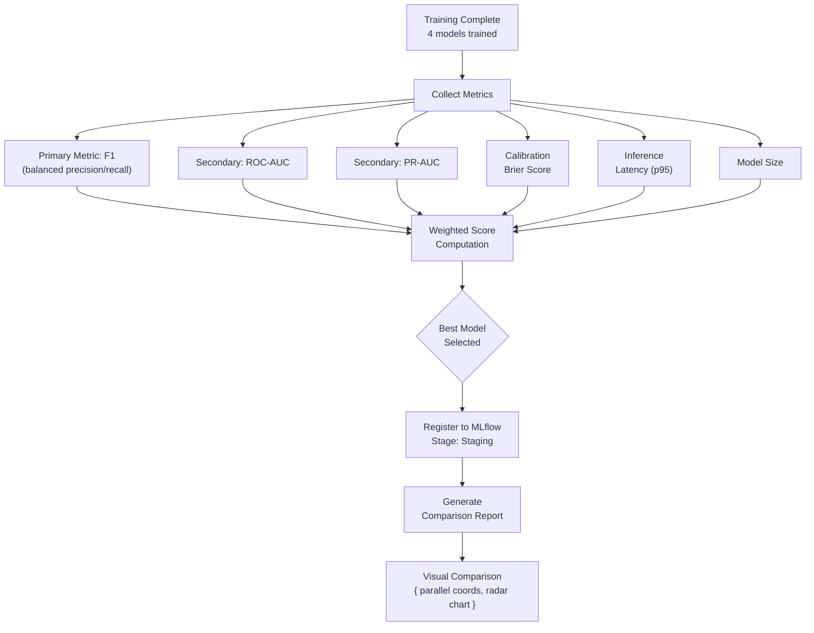

**Scoring Formula:**

```
weighted_score = 0.35 * normalized(F1)
              + 0.25 * normalized(ROC-AUC)
              + 0.15 * normalized(PR-AUC)
              - 0.10 * normalized(Brier)
              - 0.10 * normalized(latency)
              - 0.05 * normalized(model_size_mb)
```

### 3.3 Threshold Selection

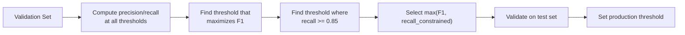

**Default Thresholds:**

| Risk Level | Score Range | Action |
|------------|-------------|--------|
| LOW | 0.00 – 0.20 | Standard discharge |
| MODERATE | 0.20 – 0.35 | Enhanced discharge instructions |
| HIGH | 0.35 – 0.65 | Care coordination workflow triggered |
| CRITICAL | 0.65 – 1.00 | Immediate care team notification |

### 3.4 Model Rollback Strategy

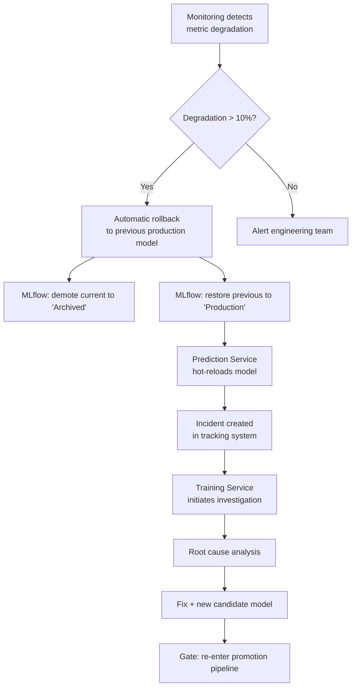

## 4. Observability Architecture

### 4.1 Logging

Every service outputs structured JSON logs via `structlog`:

```json
{
    "timestamp": "2026-07-15T14:30:00.123Z",
    "level": "INFO",
    "service": "prediction-service",
    "request_id": "a1b2c3d4-e5f6-7890-abcd-ef1234567890",
    "event": "prediction_completed",
    "user_id": "usr_42",
    "patient_id": "pat_789",
    "model_version": "3.2.1",
    "latency_ms": 142,
    "risk_score": 0.72,
    "risk_level": "HIGH",
    "trace_id": "trace_xyz"
}
```

### 4.2 Metrics (Prometheus)

**Prediction Service:**

| Metric | Type | Labels |
|--------|------|--------|
| `predictions_total` | Counter | model, risk_level, status |
| `prediction_latency_seconds` | Histogram | model, quantile (p50/p95/p99) |
| `model_version_current` | Gauge | model_name |
| `shap_computation_time` | Histogram | - |
| `model_load_time_seconds` | Histogram | model_name |
| `model_load_attempts_total` | Counter | model_name, status |

**Workflow Service:**

| Metric | Type | Labels |
|--------|------|--------|
| `workflow_triggers_total` | Counter | workflow_type |
| `workflow_duration_seconds` | Histogram | workflow_type, status |
| `workflow_retries_total` | Counter | workflow_type |
| `workflow_failures_total` | Counter | workflow_type, reason |

**Gateway:**

| Metric | Type | Labels |
|--------|------|--------|
| `http_requests_total` | Counter | method, endpoint, status_code |
| `http_request_duration_seconds` | Histogram | method, endpoint |
| `active_connections` | Gauge | - |
| `rate_limit_exceeded_total` | Counter | user_id |

### 4.3 Alerting Rules (Prometheus)

```yaml
# prediction_alerts.yml
groups:
  - name: prediction
    rules:
      - alert: HighPredictionLatency
        expr: histogram_quantile(0.95, rate(prediction_latency_seconds_bucket[5m])) > 1.0
        for: 5m
        labels: { severity: warning }
        annotations:
          summary: "Prediction latency p95 > 1s"

      - alert: PredictionServiceDown
        expr: up{job="prediction-service"} == 0
        for: 1m
        labels: { severity: critical }
        annotations:
          summary: "Prediction service unreachable"

      - alert: ModelDriftDetected
        expr: rate(predictions_total{risk_level="HIGH"}[1h]) > 1.5 * rate(predictions_total{risk_level="HIGH"}[1d])
        for: 30m
        labels: { severity: warning }
        annotations:
          summary: "Potential data drift — HIGH risk predictions up {{ $value | humanize }}x"

  - name: workflow
    rules:
      - alert: WorkflowFailureRateHigh
        expr: rate(workflow_failures_total[15m]) > 0.1
        for: 5m
        labels: { severity: critical }

      - alert: WorkflowStuck
        expr: time() - workflow_last_success > 3600
        for: 10m
        labels: { severity: warning }
```

### 4.4 Health Endpoints

Every service implements:

```
GET /health          → {"status": "healthy", "version": "1.0.0", "uptime_seconds": 12345}
GET /health/ready    → {"ready": true, "dependencies": {"postgres": "up", "mlflow": "up", "redis": "up"}}
GET /health/live     → {"alive": true}
```

## 5. Security Architecture

### 5.1 Authentication

- JWT-based with RS256 signing
- Access token: 15-minute expiry
- Refresh token: 7-day expiry (HTTP-only secure cookie)
- Token stored: Authorization Bearer header (access), secure cookie (refresh)
- Blacklist: compromised tokens via Redis invalid set
- Roles: `admin`, `clinician`, `coordinator`, `viewer`

### 5.2 Authorization (RBAC)

| Resource | Admin | Clinician | Coordinator | Viewer |
|----------|-------|-----------|-------------|--------|
| Dashboard | R/W | R | R | R |
| Patients | R/W | R/W | R | R |
| Predictions | R/W | R/W | R | R |
| Training | R/W | - | - | - |
| Model Registry | R/W | R | - | R |
| Experiments | R/W | R | - | R |
| Workflow Config | R/W | - | R | - |
| Audit Logs | R | - | - | - |
| User Management | R/W | - | - | - |

### 5.3 Data Protection

- **At Rest:** PostgreSQL TDE, Azure Storage encryption (server-side)
- **In Transit:** TLS 1.3 minimum, mTLS between internal services
- **Secrets:** Azure Key Vault, never in environment variables or config files
- **PHI:** Synthetic data only; PHI scanner on all input/output payloads
- **Audit:** All access to prediction data logged immutably

## 6. API Versioning

- URL-based versioning: `/api/v1/`, `/api/v2/`
- Deprecation policy: minor versions backward-compatible within major version
- Sunset header: `Sunset: Sat, 15 Jan 2027 00:00:00 GMT`
- Migration guide published for each major version change
- Health endpoint reflects API version

## 7. Performance Targets

| Metric | Target | Degradation Threshold |
|--------|--------|----------------------|
| Prediction latency (p50) | < 100ms | > 200ms |
| Prediction latency (p95) | < 500ms | > 1s |
| Prediction latency (p99) | < 1s | > 2s |
| SHAP computation (p50) | < 200ms | > 500ms |
| LLM explanation (p95) | < 3s | > 5s |
| API throughput | 500 req/s | 300 req/s |
| Model hot-reload | < 5s | > 15s |
| Database query (simple) | < 10ms | > 50ms |
| Database query (complex) | < 100ms | > 500ms |
| Workflow trigger → notification | < 30s | > 60s |

## 8. Scalability Architecture

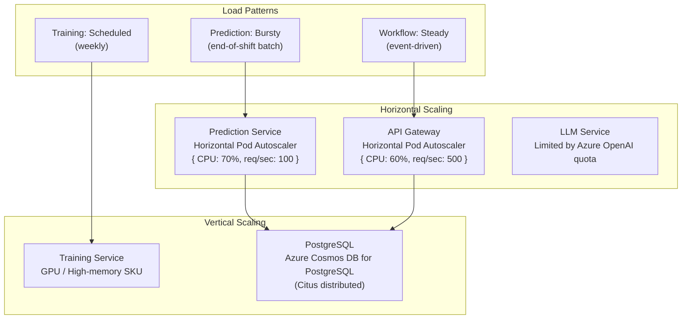

## 9. Cost Optimization

| Strategy | Implementation | Estimated Savings |
|----------|---------------|-------------------|
| Model caching | In-memory SHAP explainer reuse | 60% on compute |
| Batch predictions | `/predict/batch` endpoint | 40% on API calls |
| Connection pooling | PgBouncer / Azure PG pool | 30% on DB connections |
| Cold start optimization | Keep-warm via health probe | Eliminates cold starts |
| MLflow artifact cleanup | Lifecycle policy (30d staging) | 50% on blob storage |
| LLM token optimization | Greedy decoding, token limits | 40% on API costs |
| Autoscaling floor | Min 2, max 10 instances | Prevents over-provisioning |