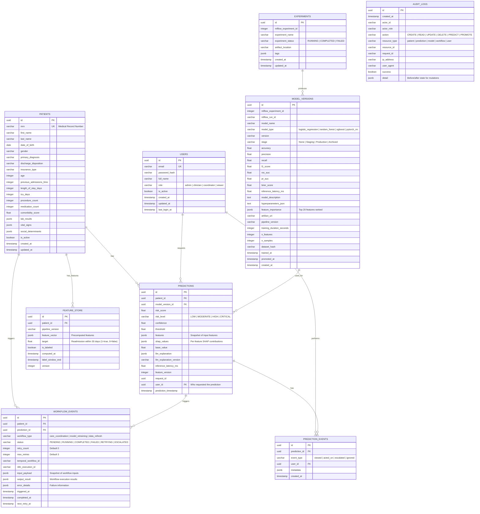

# Data Model

## Entity Relationship Diagram



## Detailed Table Definitions

### `users`

```sql
CREATE TABLE users (
    id              UUID PRIMARY KEY DEFAULT gen_random_uuid(),
    email           VARCHAR(255) NOT NULL UNIQUE,
    password_hash   VARCHAR(255) NOT NULL,
    full_name       VARCHAR(255) NOT NULL,
    role            VARCHAR(20) NOT NULL CHECK (role IN ('admin', 'clinician', 'coordinator', 'viewer')),
    is_active       BOOLEAN NOT NULL DEFAULT TRUE,
    created_at      TIMESTAMPTZ NOT NULL DEFAULT NOW(),
    updated_at      TIMESTAMPTZ NOT NULL DEFAULT NOW(),
    last_login_at   TIMESTAMPTZ
);

CREATE INDEX idx_users_email ON users(email);
CREATE INDEX idx_users_role ON users(role) WHERE is_active = TRUE;
```

### `patients`

```sql
CREATE TABLE patients (
    id                      UUID PRIMARY KEY DEFAULT gen_random_uuid(),
    mrn                     VARCHAR(50) NOT NULL UNIQUE,
    first_name              VARCHAR(100) NOT NULL,
    last_name               VARCHAR(100) NOT NULL,
    date_of_birth           DATE NOT NULL,
    gender                  VARCHAR(20),
    primary_diagnosis       VARCHAR(255),
    discharge_disposition   VARCHAR(100),
    insurance_type          VARCHAR(50),
    age                     INTEGER,
    previous_admissions_6mo INTEGER DEFAULT 0,
    length_of_stay_days     INTEGER,
    icu_days                INTEGER DEFAULT 0,
    procedure_count         INTEGER DEFAULT 0,
    medication_count        INTEGER DEFAULT 0,
    comorbidity_score       REAL DEFAULT 0,
    lab_results             JSONB,
    vital_signs             JSONB,
    social_determinants     JSONB,
    is_active               BOOLEAN NOT NULL DEFAULT TRUE,
    created_at              TIMESTAMPTZ NOT NULL DEFAULT NOW(),
    updated_at              TIMESTAMPTZ NOT NULL DEFAULT NOW()
);

CREATE INDEX idx_patients_mrn ON patients(mrn);
CREATE INDEX idx_patients_name ON patients(last_name, first_name);
CREATE INDEX idx_patients_active ON patients(is_active) WHERE is_active = TRUE;
CREATE INDEX idx_patients_diagnosis ON patients(primary_diagnosis);
```

### `predictions` (partitioned)

```sql
CREATE TABLE predictions (
    id                      UUID NOT NULL DEFAULT gen_random_uuid(),
    patient_id              UUID NOT NULL,
    model_version_id        UUID NOT NULL,
    risk_score              REAL NOT NULL,
    risk_level              VARCHAR(10) NOT NULL CHECK (risk_level IN ('LOW', 'MODERATE', 'HIGH', 'CRITICAL')),
    confidence              REAL NOT NULL,
    threshold               REAL NOT NULL,
    features                JSONB NOT NULL,
    shap_values             JSONB,
    base_value              REAL,
    llm_explanation         JSONB,
    llm_explanation_version VARCHAR(20),
    inference_latency_ms    INTEGER,
    feature_version         INTEGER NOT NULL DEFAULT 1,
    request_id              UUID,
    user_id                 UUID,
    prediction_timestamp    TIMESTAMPTZ NOT NULL DEFAULT NOW(),
    PRIMARY KEY (prediction_timestamp, id)
) PARTITION BY RANGE (prediction_timestamp);

-- Monthly partitions
CREATE TABLE predictions_2026_01 PARTITION OF predictions
    FOR VALUES FROM ('2026-01-01') TO ('2026-02-01');
CREATE TABLE predictions_2026_02 PARTITION OF predictions
    FOR VALUES FROM ('2026-02-01') TO ('2026-03-01');
CREATE TABLE predictions_2026_03 PARTITION OF predictions
    FOR VALUES FROM ('2026-03-01') TO ('2026-04-01');
-- ... additional partitions created via cron

CREATE INDEX idx_predictions_patient ON predictions(patient_id, prediction_timestamp DESC);
CREATE INDEX idx_predictions_risk ON predictions(risk_level, prediction_timestamp DESC)
    WHERE risk_level IN ('HIGH', 'CRITICAL');
CREATE INDEX idx_predictions_model ON predictions(model_version_id);
```

### `model_versions`

```sql
CREATE TABLE model_versions (
    id                      UUID PRIMARY KEY DEFAULT gen_random_uuid(),
    mlflow_experiment_id    INTEGER,
    mlflow_run_id           VARCHAR(50),
    model_name              VARCHAR(100) NOT NULL,
    model_type              VARCHAR(30) NOT NULL CHECK (model_type IN (
                                'logistic_regression', 'random_forest', 'xgboost', 'pytorch_nn'
                            )),
    version                 VARCHAR(20) NOT NULL,
    stage                   VARCHAR(20) NOT NULL DEFAULT 'None' CHECK (stage IN (
                                'None', 'Staging', 'Production', 'Archived'
                            )),
    accuracy                REAL,
    precision               REAL,
    recall                  REAL,
    f1_score                REAL,
    roc_auc                 REAL,
    pr_auc                  REAL,
    brier_score             REAL,
    inference_latency_ms    REAL,
    model_description       TEXT,
    hyperparameters_json    JSONB,
    feature_importance      JSONB,
    artifact_uri            VARCHAR(500),
    pipeline_version        VARCHAR(20),
    training_duration_seconds INTEGER,
    n_features              INTEGER,
    n_samples               INTEGER,
    dataset_hash            VARCHAR(64),
    trained_at              TIMESTAMPTZ,
    promoted_at             TIMESTAMPTZ,
    created_at              TIMESTAMPTZ NOT NULL DEFAULT NOW(),

    CONSTRAINT unique_model_version UNIQUE (model_name, version)
);

CREATE INDEX idx_model_versions_stage ON model_versions(stage) WHERE stage IN ('Production', 'Staging');
CREATE INDEX idx_model_versions_name ON model_versions(model_name, created_at DESC);
```

### `workflow_events` (partitioned)

```sql
CREATE TABLE workflow_events (
    id                      UUID NOT NULL DEFAULT gen_random_uuid(),
    patient_id              UUID,
    prediction_id           UUID,
    workflow_type           VARCHAR(30) NOT NULL CHECK (workflow_type IN (
                                'care_coordination', 'model_retraining', 'data_refresh'
                            )),
    status                  VARCHAR(20) NOT NULL CHECK (status IN (
                                'PENDING', 'RUNNING', 'COMPLETED', 'FAILED', 'RETRYING', 'ESCALATED'
                            )),
    retry_count             INTEGER NOT NULL DEFAULT 0,
    max_retries             INTEGER NOT NULL DEFAULT 3,
    temporal_workflow_id    VARCHAR(100),
    n8n_execution_id        VARCHAR(100),
    input_payload           JSONB,
    output_result           JSONB,
    error_details           JSONB,
    triggered_at            TIMESTAMPTZ NOT NULL DEFAULT NOW(),
    completed_at            TIMESTAMPTZ,
    next_retry_at           TIMESTAMPTZ,
    PRIMARY KEY (triggered_at, id)
) PARTITION BY RANGE (triggered_at);

CREATE INDEX idx_workflow_patient ON workflow_events(patient_id, triggered_at DESC);
CREATE INDEX idx_workflow_status ON workflow_events(status, triggered_at DESC)
    WHERE status IN ('PENDING', 'RUNNING', 'RETRYING');
CREATE INDEX idx_workflow_type ON workflow_events(workflow_type, triggered_at DESC);
```

### `audit_logs` (partitioned)

```sql
CREATE TABLE audit_logs (
    id              UUID NOT NULL DEFAULT gen_random_uuid(),
    created_at      TIMESTAMPTZ NOT NULL DEFAULT NOW(),
    actor_id        VARCHAR(100) NOT NULL,
    actor_role      VARCHAR(20) NOT NULL,
    action          VARCHAR(20) NOT NULL CHECK (action IN (
                        'CREATE', 'READ', 'UPDATE', 'DELETE', 'PREDICT', 'PROMOTE'
                    )),
    resource_type   VARCHAR(20) NOT NULL CHECK (resource_type IN (
                        'patient', 'prediction', 'model', 'workflow', 'user'
                    )),
    resource_id     VARCHAR(100),
    request_id      UUID,
    ip_address      INET,
    user_agent      VARCHAR(500),
    success         BOOLEAN NOT NULL DEFAULT TRUE,
    detail          JSONB,
    PRIMARY KEY (created_at, id)
) PARTITION BY RANGE (created_at);

CREATE INDEX idx_audit_actor ON audit_logs(actor_id, created_at DESC);
CREATE INDEX idx_audit_resource ON audit_logs(resource_type, resource_id, created_at DESC);
CREATE INDEX idx_audit_action ON audit_logs(action, created_at DESC);
```

### `feature_store`

```sql
CREATE TABLE feature_store (
    id                  UUID PRIMARY KEY DEFAULT gen_random_uuid(),
    patient_id          UUID NOT NULL,
    pipeline_version    VARCHAR(20) NOT NULL,
    feature_vector      JSONB NOT NULL,
    target              SMALLINT CHECK (target IN (0, 1)),
    is_labeled          BOOLEAN NOT NULL DEFAULT FALSE,
    computed_at         TIMESTAMPTZ NOT NULL DEFAULT NOW(),
    label_window_end    TIMESTAMPTZ,
    version             INTEGER NOT NULL DEFAULT 1
);

CREATE INDEX idx_feature_patient ON feature_store(patient_id, version DESC);
CREATE INDEX idx_feature_pipeline ON feature_store(pipeline_version, computed_at DESC);
CREATE INDEX idx_feature_labeled ON feature_store(is_labeled) WHERE is_labeled = TRUE;
```

## Data Type Mapping

| PostgreSQL | Python (Pydantic) | Description |
|------------|-------------------|-------------|
| UUID | uuid.UUID | Primary keys, foreign keys |
| VARCHAR | str | Text fields |
| INTEGER | int | Counts, IDs |
| REAL | float | Continuous values |
| BOOLEAN | bool | Flags |
| JSONB | dict | Flexible metadata, features |
| TIMESTAMPTZ | datetime (UTC) | All timestamps |
| DATE | date | Dates without time |
| INET | str (IP address) | IP addresses |

## Row Size Estimates

| Table | Row Size | 1M Rows | 10M Rows | 100M Rows |
|-------|----------|---------|----------|-----------|
| users | ~500B | 0.5 GB | - | - |
| patients | ~2KB | 2 GB | 20 GB | - |
| predictions | ~4KB | 4 GB | 40 GB | 400 GB |
| workflow_events | ~2KB | 2 GB | 20 GB | 200 GB |
| audit_logs | ~1KB | 1 GB | 10 GB | 100 GB |
| model_versions | ~2KB | - | - | - |
| feature_store | ~3KB | 3 GB | 30 GB | - |

## Migration Strategy

- Alembic for schema migrations with version control
- Each service manages its own migration scope
- Backward-compatible changes only (add columns, not remove)
- Zero-downtime migrations via:
  1. Add new column (NULLABLE)
  2. Backfill in batches
  3. Add NOT NULL constraint
  4. Deploy code referencing new column
  5. Drop old column in next release