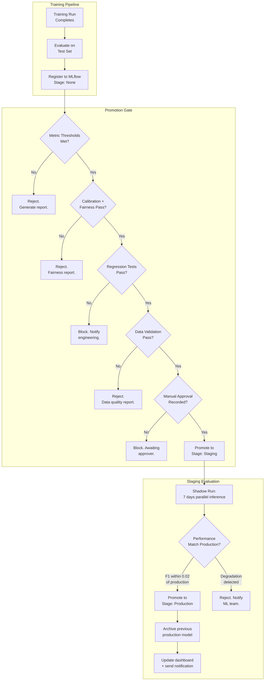
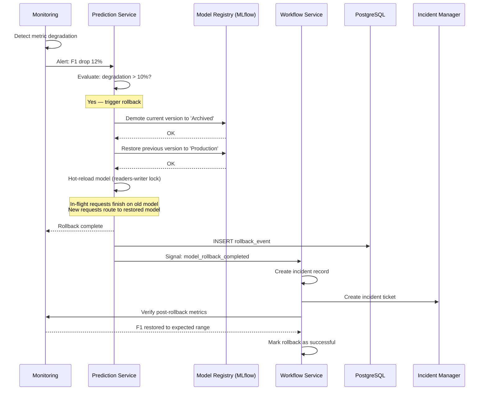
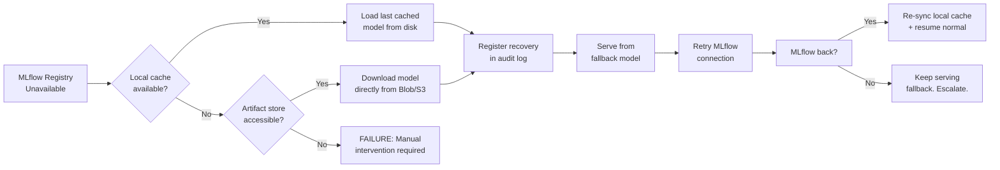
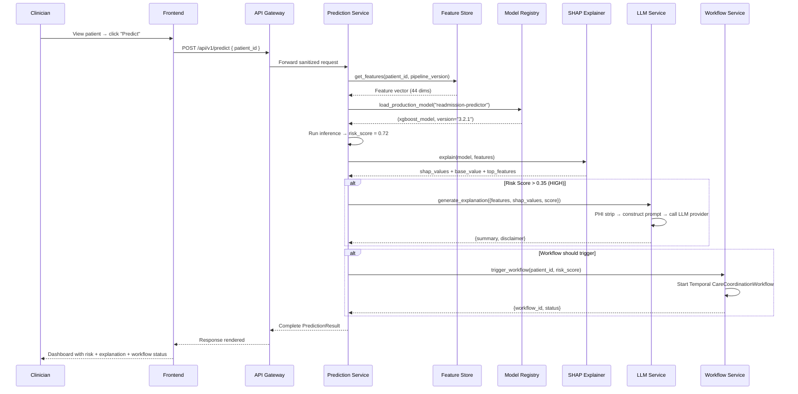
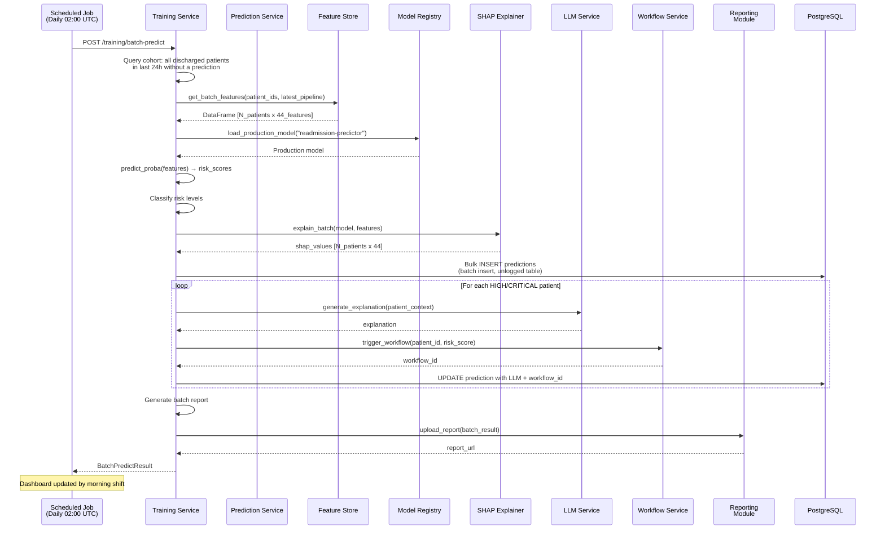

# Enterprise Architecture Review

## Strengthening Production Readiness, Maintainability, Reliability, and Operational Excellence

**Review Date:** 2026-07-20
**Scope:** Full architecture audit — no feature additions, no design restructuring
**Status:** Approved — architecture frozen for implementation

---

# 1. Technology Abstraction Layer

## 1.1 Rationale

Every third-party dependency is hidden behind a Python protocol (interface). Business logic imports the protocol, not the vendor SDK. This means any vendor can be replaced by implementing the same protocol — no changes to prediction, training, or workflow code.

## 1.2 Interface Boundaries

### 1.2.1 Feature Store Interface

```python
from typing import Protocol, Optional
from datetime import datetime
import pandas as pd

class FeatureStoreProtocol(Protocol):
    """Interface for feature storage and retrieval.
    
    Implementations: PostgreSQLFeatureStore, FeastFeatureStore, RedisFeatureStore
    """
    
    async def get_features(
        self, patient_id: str, pipeline_version: str
    ) -> pd.DataFrame:
        """Retrieve precomputed features for a patient at a pipeline version."""
        ...

    async def store_features(
        self, patient_id: str, pipeline_version: str,
        features: pd.DataFrame, target: Optional[float]
    ) -> str:
        """Store computed features. Returns feature record ID."""
        ...

    async def get_batch_features(
        self, patient_ids: list[str], pipeline_version: str
    ) -> pd.DataFrame:
        """Batch feature retrieval for cohort scoring."""
        ...

    async def get_latest_pipeline_version(self) -> str:
        """Return the most recent feature pipeline version."""
        ...

    async def health(self) -> bool:
        """Liveness check."""
        ...
```

**Boundary:** The Prediction Service and Training Service speak only to `FeatureStoreProtocol`. The PostgreSQL implementation is injected at startup via the service container. To swap to Feast, write `FeastFeatureStore(FeatureStoreProtocol)` and change the wiring — zero business logic changes.

### 1.2.2 Model Registry Interface

```python
class ModelRegistryProtocol(Protocol):
    """Interface for model storage, versioning, and retrieval.
    
    Implementations: MLflowRegistry, S3ModelRegistry, GCSModelRegistry
    """
    
    async def load_production_model(self, model_name: str) -> tuple["BaseModel", str]:
        """Load the currently promoted production model. Returns (model, version)."""
        ...

    async def register_model(
        self, model: "BaseModel", model_name: str,
        version: str, metrics: dict, artifacts: list[str]
    ) -> str:
        """Register a new model version. Returns registry ID."""
        ...

    async def promote_to_production(self, model_name: str, version: str) -> None:
        """Promote a staging model to production. Demotes previous."""
        ...

    async def get_model_versions(
        self, model_name: str, stage: Optional[str] = None
    ) -> list[dict]:
        """List versions, optionally filtered by stage."""
        ...

    async def rollback(self, model_name: str) -> tuple[str, str]:
        """Rollback to previous production version. Returns (new_version, old_version)."""
        ...

    async def log_metrics(self, run_id: str, metrics: dict) -> None:
        """Log evaluation metrics for a training run."""
        ...

    async def log_artifact(self, run_id: str, local_path: str, artifact_path: str) -> None:
        """Store an artifact associated with a run."""
        ...
```

**Boundary:** ADR-003 (MLflow) is updated to reflect that MLflow implements `ModelRegistryProtocol`, not that the system depends on MLflow directly. The Prediction Service loads models through this interface — the underlying registry could be a local filesystem, S3, or Google Cloud Storage without touching inference code.

### 1.2.3 LLM Provider Interface

```python
class LLMProviderProtocol(Protocol):
    """Interface for natural language explanation generation.
    
    Implementations: AzureOpenAIProvider, OpenAIProvider, AnthropicProvider,
                     LocalLLMProvider, TemplateFallbackProvider
    """
    
    async def generate_explanation(
        self, prompt_context: "ExplanationContext"
    ) -> "ExplanationResult":
        """Generate a clinician-friendly explanation from model outputs.
        
        Args:
            prompt_context: Structured data (features, SHAP values, risk score, etc.)
                           that has already been PHI-stripped.
        Returns:
            ExplanationResult with summary, factors, disclaimer.
        """
        ...

    async def health(self) -> bool:
        """Check provider availability."""
        ...
```

**Boundary:** The LLM Service routes all calls through `LLMProviderProtocol`. Azure OpenAI is the primary implementation. When Azure OpenAI is unavailable, `CircuitBreakerLLMProvider` wraps the primary and delegates to `TemplateFallbackProvider` (which generates rule-based explanations using the SHAP values directly, no LLM call). See Section 6 for failure handling.

### 1.2.4 Message Queue Interface

```python
class MessageQueueProtocol(Protocol):
    """Async message broker for event-driven communication.
    
    Implementations: RabbitMQQueue, RedisPubSubQueue, GooglePubSubQueue, SQSBatchQueue
    """
    
    async def publish(self, topic: str, payload: dict) -> None:
        """Publish an event to a topic/exchange."""
        ...

    async def subscribe(self, topic: str, handler: callable) -> None:
        """Register a handler for messages on a topic."""
        ...

    async def acknowledge(self, message_id: str) -> None:
        """Acknowledge successful processing."""
        ...

    async def dead_letter(self, message_id: str, reason: str) -> None:
        """Move a failed message to the dead-letter queue."""
        ...
```

**Boundary:** The Workflow Service and Prediction Service communicate via this interface for async events (e.g., "prediction_completed" → triggers workflow). The current implementation uses Redis PubSub for simplicity; replacing with RabbitMQ or SQS requires only a new class implementing `MessageQueueProtocol`.

### 1.2.5 Notification Provider Interface

```python
class NotificationProviderProtocol(Protocol):
    """Multi-channel notification delivery.
    
    Implementations: SMTPEmailProvider, TwilioSMSProvider, SendGridProvider,
                     SlackWebhookProvider, ConsoleNotificationProvider
    """
    
    async def send(
        self, recipient: str, template_name: str,
        context: dict, channel: str
    ) -> "NotificationResult":
        """Send a notification via the specified channel.
        
        Args:
            recipient: Email address, phone number, or webhook URL
            template_name: Named template (e.g., 'high_risk_alert')
            context: Template variable bindings
            channel: 'email' | 'sms' | 'slack'
        """
        ...

    async def get_delivery_status(self, notification_id: str) -> str:
        """Check delivery status of a previously sent notification."""
        ...
```

**Boundary:** n8n workflows call `NotificationProviderProtocol` through the Workflow Service's n8n webhook proxy. This decouples notification logic from n8n's built-in nodes, allowing channel switching without workflow changes.

### 1.2.6 Object Storage Interface

```python
class ObjectStorageProtocol(Protocol):
    """Blob/object storage for ML artifacts, model files, and backups.
    
    Implementations: AzureBlobStorage, S3Storage, GCSStorage, LocalFileStorage
    """
    
    async def upload(self, local_path: str, remote_key: str) -> str:
        """Upload a file. Returns the remote URI."""
        ...

    async def download(self, remote_key: str, local_path: str) -> str:
        """Download a file. Returns the local path."""
        ...

    async def delete(self, remote_key: str) -> None:
        """Delete a stored object."""
        ...

    async def list(self, prefix: str) -> list[str]:
        """List objects under a prefix."""
        ...

    async def generate_signed_url(self, remote_key: str, expiry_seconds: int) -> str:
        """Generate a time-limited access URL."""
        ...

    async def health(self) -> bool:
        """Check storage backend availability."""
        ...
```

## 1.3 Dependency Injection Wiring

Each service has a `container.py` that wires implementations to protocols:

```python
# prediction_service/container.py
from mypy.extensions import mypyc_attr

class ServiceContainer:
    """Wires all dependencies. This is the only file that knows about vendors."""
    
    def __init__(self, config: AppConfig):
        # Feature Store
        if config.FEATURE_STORE_TYPE == "postgres":
            self.feature_store: FeatureStoreProtocol = PostgreSQLFeatureStore(config)
        elif config.FEATURE_STORE_TYPE == "feast":
            self.feature_store: FeatureStoreProtocol = FeastFeatureStore(config)
        
        # Model Registry
        if config.MODEL_REGISTRY_TYPE == "mlflow":
            self.model_registry: ModelRegistryProtocol = MLflowRegistry(config)
        elif config.MODEL_REGISTRY_TYPE == "s3":
            self.model_registry: ModelRegistryProtocol = S3ModelRegistry(config)
        
        # LLM Provider (with circuit breaker)
        primary_llm = AzureOpenAIProvider(config)
        fallback_llm = TemplateFallbackProvider()
        self.llm_provider: LLMProviderProtocol = CircuitBreakerLLMProvider(
            primary=primary_llm, fallback=fallback_llm,
            failure_threshold=5, recovery_timeout=30
        )
        
        # Object Storage (for artifacts)
        if config.OBJECT_STORAGE_TYPE == "azure_blob":
            self.object_storage: ObjectStorageProtocol = AzureBlobStorage(config)
        elif config.OBJECT_STORAGE_TYPE == "s3":
            self.object_storage: ObjectStorageProtocol = S3Storage(config)
        
        # Message Queue
        if config.MESSAGE_QUEUE_TYPE == "redis":
            self.message_queue: MessageQueueProtocol = RedisPubSubQueue(config)
        elif config.MESSAGE_QUEUE_TYPE == "rabbitmq":
            self.message_queue: MessageQueueProtocol = RabbitMQQueue(config)
```

## 1.4 New ADR: Dependency Inversion

### ADR-013: Dependency Inversion for All Third-Party Integrations

**Status:** Accepted
**Date:** 2026-07-20
**Supersedes:** ADR-003 (MLflow), ADR-005 (SHAP), ADR-006 (Azure OpenAI), ADR-008 (PostgreSQL Feature Store)

**Context:** The architecture directly depends on vendor-specific SDKs (MLflow, Azure OpenAI, etc.), creating vendor lock-in. Replacing any vendor requires changes across multiple services.

**Decision:** Every third-party integration is hidden behind a Python `Protocol` (interface) defined in a shared `interfaces` module. Business logic imports only the protocol. Implementation classes live in `adapters/` subdirectories. Dependency injection in each service's `container.py` wires implementations at startup based on configuration.

**Consequences:**
- **Positive:** Any vendor can be replaced by implementing the protocol — zero business logic changes
- **Positive:** Testing: mock protocols directly without vendor SDKs
- **Positive:** Multiple implementations can coexist (primary + fallback + circuit breaker)
- **Negative:** One extra abstraction layer per integration
- **Negative:** Interface design must be right the first time (costly to change protocols consumers depend on)

**Updated ADR Status:**
- ADR-003 (MLflow) → Updated: MLflow is an *implementation* of `ModelRegistryProtocol`
- ADR-005 (SHAP) → Updated: SHAP is wrapped in `ShapExplainer` implementing `ExplainerProtocol`
- ADR-006 (Azure OpenAI) → Updated: Azure OpenAI is one implementation of `LLMProviderProtocol`
- ADR-008 (PostgreSQL Feature Store) → Updated: PostgreSQL is one implementation of `FeatureStoreProtocol`

---

# 2. Model Promotion Governance

## 2.1 Promotion Gate Specification

A model version may only move from **Staging → Production** when ALL of the following conditions are satisfied:

### 2.1.1 Mandatory Conditions

| # | Condition | Check | Failure Action |
|---|-----------|-------|----------------|
| 1 | **F1 Score ≥ threshold** | `f1_score >= config.PROMOTION_MIN_F1` (default: 0.80) | Reject with report |
| 2 | **ROC-AUC ≥ threshold** | `roc_auc >= config.PROMOTION_MIN_ROC_AUC` (default: 0.85) | Reject with report |
| 3 | **PR-AUC ≥ threshold** | `pr_auc >= config.PROMOTION_MIN_PR_AUC` (default: 0.70) | Reject with report |
| 4 | **Brier Score ≤ threshold** | `brier_score <= config.PROMOTION_MAX_BRIER` (default: 0.15) | Reject with report |
| 5 | **Calibration acceptable** | Calibration error < 0.05 (expected vs. observed in 10 bins) | Reject |
| 6 | **Fairness check passed** | ΔF1 across all demographic subgroups ≤ 0.03 | Reject with fairness report |
| 7 | **No data leakage detected** | Temporal holdout performance within 0.03 of random-split performance | Reject |
| 8 | **Feature importance stable** | Top-5 features match current production model's top-5 (Jaccard similarity ≥ 0.6) | Flag for review |
| 9 | **Regression tests pass** | All unit, integration, and ML-specific tests pass (CI green) | Block promotion |
| 10 | **Data validation passes** | Dataset schema, null rates, value ranges match expected distributions (Great Expectations suite) | Reject with data quality report |
| 11 | **Inference latency acceptable** | p95 latency ≤ 2× current production model latency | Flag for review |
| 12 | **Manual approval recorded** | Audit log entry with approving user ID, role, and timestamp | Block promotion |

### 2.1.2 Promotion Workflow



### 2.1.3 Promotion API

```python
class PromotionRequest(BaseModel):
    model_version_id: str
    approved_by: str  # User ID
    approver_role: str  # Must be 'admin' or 'ml-engineer'
    approval_notes: Optional[str] = None

class PromotionResult(BaseModel):
    status: Literal["promoted", "rejected", "blocked"]
    checks: dict[str, "CheckResult"]
    previous_production: Optional[str]
    current_production: str

class CheckResult(BaseModel):
    passed: bool
    metric_value: Optional[float]
    threshold: Optional[float]
    details: Optional[str]
```

### 2.1.4 Promotion Audit Trail

Every promotion attempt (success or failure) is logged:

```json
{
    "event": "model_promotion_attempted",
    "model_name": "readmission-predictor",
    "version": "3.3.0",
    "timestamp": "2026-07-20T10:00:00Z",
    "checks": {
        "f1_score": {"passed": true, "value": 0.852, "threshold": 0.80},
        "fairness": {"passed": true, "max_delta_f1": 0.02},
        "regression_tests": {"passed": true, "commit_sha": "a1b2c3d"},
        "manual_approval": {"passed": true, "approved_by": "usr_admin_01"}
    },
    "result": "promoted",
    "previous_production": "3.2.1",
    "archived_at": "2026-07-20T10:00:05Z"
}
```

---

# 3. Rollback Strategy

## 3.1 Rollback Triggers

| Trigger | Type | Detection | Response Time |
|---------|------|-----------|---------------|
| Metric degradation >10% (F1, ROC-AUC) | Automatic | Monitoring (Prometheus) | < 60s |
| Prediction drift detected | Automatic | Drift monitoring | < 5 min |
| Latency p95 > 3× baseline | Automatic | Latency alert | < 60s |
| Error rate > 5% of predictions | Automatic | Error rate alert | < 60s |
| Data quality violation | Manual | DB validation job | < 15 min |
| Manual decision (engineering/clinical) | Manual | Admin API call | On demand |
| Incident/outage declared | Manual | Incident response | < 5 min |

## 3.2 Automatic Rollback Procedure



### 3.2.1 Rollback REST API

```python
@router.post("/api/v1/models/rollback")
async def rollback_model(
    request: RollbackRequest,
    user: User = Depends(require_role(["admin", "ml-engineer"]))
) -> RollbackResult:
    # 1. Validate rollback target exists
    previous_version = await model_registry.get_previous_production(
        request.model_name
    )
    if not previous_version:
        raise HTTPException(400, "No previous production version to rollback to")
    
    # 2. Execute rollback
    new_version, old_version = await model_registry.rollback(request.model_name)
    
    # 3. Log audit event
    await audit_logger.log(user.id, "MODEL_ROLLBACK", {
        "model_name": request.model_name,
        "from_version": old_version,
        "to_version": new_version,
        "reason": request.reason
    })
    
    # 4. Verify prediction service loaded new model
    health = await prediction_client.check_model_loaded()
    if not health["model_loaded"]:
        # Fallback: force prediction service to reload
        await prediction_client.reload_model()
    
    # 5. Return result
    return RollbackResult(
        status="success",
        previous_production=old_version,
        current_production=new_version,
        reloaded_at=datetime.utcnow()
    )
```

## 3.3 Registry Version Recovery

If the MLflow registry itself is corrupted or unavailable:



## 3.4 Workflow Recovery After Rollback

When a model rollback occurs, in-flight workflows continue using their already-computed predictions. Subsequent predictions use the rolled-back model. Workflows already executing under the degraded model are not retroactively cancelled — instead, a flag is set:

```json
{
    "workflow_id": "wf_abc123",
    "model_version_at_trigger": "3.3.0",
    "model_version_rolled_back": true,
    "rollback_event_id": "rb_001",
    "action_taken": "continue_with_existing"
}
```

## 3.5 Rollback Verification Checklist

| Step | Check | Validation |
|------|-------|------------|
| 1 | Model loaded | `GET /health/ready` → `model_loaded: true`, `model_version: "3.2.1"` |
| 2 | Inference working | `POST /predict` with test patient → 200 + valid response |
| 3 | SHAP working | Response includes `shap_values` with valid structure |
| 4 | LLM explanation still triggered | For high-risk predictions, response includes `llm_explanation` |
| 5 | Metrics stable | Prometheus query: rate of errors after rollback < 1% |
| 6 | Workflow triggering restored | For high-risk predictions, `workflow.triggered: true` |
| 7 | Audit logged | `audit_logs` table has `MODEL_ROLLBACK` event |
| 8 | Dashboard reflects change | Model version in frontend updated |

---

# 4. Batch and Real-Time Inference Architecture

## 4.1 Real-Time Inference

### 4.1.1 Flow



**Characteristics:**
- Request-response (synchronous, < 3s target)
- Triggered by clinician action
- Single patient per request
- Includes SHAP + LLM + workflow trigger
- Model and features loaded on demand from registry/store

**Service Dependencies (real-time path):**

| Service | Required? | Fallback If Unavailable |
|---------|-----------|------------------------|
| Feature Store | Yes | Fail open with error; cached features acceptable for 24h |
| Model Registry | Yes | Use local disk cache; stale model better than no model |
| SHAP | Yes | Degrade gracefully: return prediction without explanation |
| LLM | No | Omit LLM explanation; return SHAP-only explanation |
| Workflow Service | No | Queue workflow trigger; execute when service recovers |

## 4.2 Batch Inference

### 4.2.1 Flow



**Characteristics:**
- Scheduled (daily/on-demand)
- Process cohort of patients (100-1000 per batch)
- Asynchronous — results available in morning
- SHAP computed for all patients
- LLM explanation + workflow trigger only for high-risk patients
- Performance: ~10s per 100 patients (including SHAP)

**API:**

```python
@router.post("/api/v1/predict/batch")
async def batch_predict(request: BatchPredictRequest) -> BatchPredictResponse:
    """
    Trigger a batch prediction job.
    
    Request:
        cohort_filter: Optional filter criteria (diagnosis, ward, timeframe)
        generate_explanations: bool (default: True)
        trigger_workflows: bool (default: True)
    
    Response:
        batch_id: str (for tracking)
        status: "QUEUED" | "RUNNING"
        estimated_patients: int
        estimated_duration_seconds: int
        tracking_url: str (dashboard link)
    """
    ...

@router.get("/api/v1/predict/batch/{batch_id}")
async def get_batch_status(batch_id: str) -> BatchStatusResponse:
    """
    Query batch job status and results.
    
    Response:
        batch_id: str
        status: "QUEUED" | "RUNNING" | "COMPLETED" | "FAILED"
        progress: { completed: int, total: int, failed: int }
        summary: {
            total_predictions: int,
            high_risk: int, moderate_risk: int, low_risk: int,
            mean_risk_score: float
        }
        completed_at: Optional[datetime]
    """
    ...
```

### 4.2.2 Batch vs. Real-Time Comparison

| Dimension | Real-Time | Batch |
|-----------|-----------|-------|
| Trigger | Clinician action | Scheduled (daily) |
| Latency | < 3s | 1-10 min |
| Patients per run | 1 | 100-1000 |
| SHAP computation | Per patient, on demand | Precomputed for cohort |
| LLM explanations | Real-time, on demand | Precomputed for high-risk only |
| Workflow trigger | Immediate | Within batch window |
| Error handling | Per-request timeout | Retry + DLQ per patient |
| Resource profile | Spiky (shift changes) | Predictable (nighttime) |
| Cost per patient | Higher (hot path) | Lower (amortized compute) |

---

# 5. Continuous Retraining Pipeline

## 5.1 Automated Lifecycle

```mermaid
flowchart LR
    subgraph "Data Pipeline"
        A["New Patient Data<br/>Accumulated"] --> B["Data Validation<br/>(Great Expectations)"]
        B --> C{"Valid?"}
        C -->|Yes| D["Feature Engineering<br/>Pipeline vN"]
        C -->|No| E["Quarantine.<br/>Notify data team."]
    end

    subgraph "Training Pipeline"
        D --> F["Dataset Assembly<br/>{ features + labels }"]
        F --> G["Train/Val/Test Split<br/>(temporal holdout)"]
        G --> H["Train 4 Models<br/>+ Optuna HPO"]
        H --> I["Evaluate + Compare"]
        I --> J["Select Best Model"]
    end

    subgraph "Registration"
        J --> K["Register to MLflow<br/>Stage: None"]
        K --> L["Generate Model Card"]
    end

    subgraph "Promotion Gate"
        L --> M["Run Promotion Checks<br/>{ 12 conditions }"]
        M --> N{"All Pass?"}
        N -->|Yes| O["Promote to Staging"]
        N -->|No| P["Reject. Report."]
        O --> Q["7-Day Shadow Run<br/>(parallel inference)"]
        Q --> R{"Performance<br/>Matches Prod?"}
        R -->|Yes| S["Promote to Production"]
        R -->|No| T["Reject. Archive."]
    end

    subgraph "Rollback Safety"
        S --> U["Previous model<br/>auto-archived"]
        U --> V["Monitoring<br/>active"]
        V --> W{"Degradation<br/>Detected?"}
        W -->|Yes| X["Auto-rollback"]
        W -->|No| Y["Continue serving"]
    end
```



## 5.2 Scheduling and Triggers

| Trigger | Frequency | Description |
|---------|-----------|-------------|
| Scheduled | Weekly (Sunday 03:00 UTC) | Full retraining with latest N weeks of data |
| Data accumulation threshold | On demand | When 5,000 new labeled cases accumulate |
| Drift detected | Event-driven | Monitoring detects prediction drift > 1.5σ |
| Manual | On demand | Admin triggers via API |

## 5.3 Approval Checkpoints

| Checkpoint | Type | Who | Condition |
|------------|------|-----|-----------|
| 1. Data validation | Automatic | — | Great Expectations suite passes |
| 2. Model metrics | Automatic | — | All 6 metric thresholds met |
| 3. Fairness audit | Automatic | — | ΔF1 across groups ≤ 0.03 |
| 4. Staging promotion | Automatic | — | Checks 1-3 pass |
| 5. Shadow run completion | Automatic | — | 7 days without degradation |
| 6. Production promotion | Automatic + Manual | ML Engineer | Check 5 passes + manual approval recorded |

## 5.4 Rollback During Retraining

If a retraining run fails mid-cycle, the system:
1. Logs the failure with full context
2. Preserves the current production model unchanged
3. Sends alert to ML engineering team
4. Does NOT attempt re-training until the issue is resolved
5. Skips the next scheduled retraining if the previous failed within 24h

---

# 6. Failure Handling and Graceful Degradation

## 6.1 Failure Handling Matrix

### 6.1.1 Azure OpenAI Unavailable

| Layer | Behavior | Details |
|-------|----------|---------|
| Detection | Circuit breaker | 5 consecutive failures → open circuit (30s recovery timeout) |
| Fallback | TemplateFallbackProvider | Generate rule-based explanation from SHAP values directly |
| Impact | No LLM explanation | Prediction + SHAP explanation still returned; `llm_explanation` field omitted |
| Recovery | Half-open | After timeout, probe 1 request; if success, close circuit |
| Alert | Yes | PagerDuty notification if circuit open > 5 min |
| Metric | `llm_fallback_total`, `llm_circuit_breaker_state` | Counter + gauge |

### 6.1.2 MLflow Unavailable

| Layer | Behavior | Details |
|-------|----------|---------|
| Detection | Connection timeout (5s) + retry (3 attempts, 1s backoff) | |
| Fallback | Local disk cache | Last-known production model loaded from `/models/cache/` |
| Impact | Stale model served | Model version may lag behind latest registry version |
| Recovery | Background poll (every 60s) | When MLflow returns, hot-reload and clear cache |
| Alert | Yes | Warning if cache-only > 1 hour; critical if > 24 hours |
| Training | Cannot start | `POST /training/start` returns 503 with retry-after header |
| Metric | `model_registry_fallback_active` | Gauge (1 = serving from cache) |

### 6.1.3 Feature Store Unavailable

| Layer | Behavior | Details |
|-------|----------|---------|
| Detection | Connection timeout (3s) + retry (2 attempts) | |
| Fallback | Redis cache of recent features | Features cached for 24h per patient |
| Impact | Stale features used | May cause inaccurate predictions for recently updated patients |
| Recovery | Background refresh | On reconnect, invalidate stale cache entries |
| Real-time | Degraded | Serves from cache; new patients without recent features return error |
| Batch | Queued | Batch job paused; retry on next cycle |
| Alert | Yes | Critical if unavailable > 5 min |
| Metric | `feature_store_cache_hit_ratio`, `feature_store_errors_total` | |

### 6.1.4 Message Queue Unavailable

| Layer | Behavior | Details |
|-------|----------|---------|
| Detection | Connection timeout + retry | |
| Fallback | Local SQLite buffer | Events queued locally, replayed when queue reconnects |
| Impact | Delayed async notifications | Workflow triggers and audit events queued locally |
| Recovery | Drain local buffer | On reconnect, publish buffered events in order |
| Alert | Yes | Warning if buffer > 1000 events |
| Metric | `queue_buffer_size`, `queue_drain_latency` | |

### 6.1.5 SHAP Computation Failure

| Layer | Behavior | Details |
|-------|----------|---------|
| Detection | Exception in explainer.compute() | |
| Fallback | Return prediction without explanation | `explanation` field contains `null` with error metadata |
| Impact | Missing SHAP plot and feature importance | Prediction + LLM explanation still returned (LLM uses raw feature values) |
| Recovery | Retry on next prediction for same patient | Fresh attempt; no persistent blacklist |
| Alert | Yes | Warning if > 10% of SHAP computations fail in 5min window |
| Metric | `shap_computation_failures_total` | Counter |

### 6.1.6 Database Outage

| Layer | Behavior | Details |
|-------|----------|---------|
| Detection | Connection pool exhaustion, query timeout (10s) | |
| Fallback | Prediction service: cache-only mode (no DB writes) | Predictions computed but not persisted |
| Fallback | Workflow service: queue mode | Workflow events buffered locally |
| Impact | Predictions returned but not logged | Dashboard may be stale; audit trail incomplete |
| Recovery | Connection pool drain + reconnect | On reconnect, flush buffered writes in order |
| Alert | Yes | Critical if unavailable > 30s |
| Read replicas | Serve dashboard queries from read replica | If read replica available, dashboard remains functional |
| Metric | `db_connection_pool_size`, `db_query_errors_total`, `db_fallback_mode` | |

### 6.1.7 Workflow Execution Failure

| Layer | Behavior | Details |
|-------|----------|---------|
| Detection | Temporal activity failure | |
| Retry | 3 attempts (exponential backoff: 5s, 15s, 45s) | |
| Dead-letter | After 3 retries | Moved to dead-letter queue; workflow marked FAILED |
| Escalation | n8n escalation handler triggered | Notify on-call + create incident |
| Partial completion | Compensation transactions | If appointment created but notification fails, roll back appointment |
| Impact | Patient may not receive follow-up | Flagged for manual review |
| Alert | Yes | Critical if any workflow fails all retries |
| Metric | `workflow_dlq_size`, `workflow_escalation_total` | |

## 6.2 Circuit Breaker Configuration

| Service | Failure Threshold | Recovery Timeout | Half-Open Max Requests |
|---------|------------------|------------------|----------------------|
| Azure OpenAI | 5 failures | 30s | 1 |
| MLflow | 3 failures | 15s | 2 |
| Feature Store | 3 failures | 10s | 2 |
| n8n webhooks | 3 failures | 30s | 1 |
| Temporal Server | 2 failures | 10s | 2 |

## 6.3 Retry Policy Summary

| Operation | Max Retries | Backoff | Jitter | Timeout |
|-----------|-------------|---------|--------|---------|
| Database query | 2 | 100ms, 500ms | ±25ms | 10s |
| MLflow model load | 3 | 1s, 2s, 4s | ±100ms | 30s |
| Azure OpenAI call | 2 | 1s, 3s | ±200ms | 10s |
| Feature store fetch | 2 | 500ms, 1s | ±50ms | 5s |
| n8n webhook | 3 | 5s, 15s, 45s | ±1s | 60s |
| Temporal activity | 3 | 5s, 15s, 45s | ±1s | 120s |

---

# 7. Data Governance

## 7.1 Dataset Ownership

| Dataset | Owner | Steward | Description |
|---------|-------|---------|-------------|
| Patient records | Clinical Data Team | Data Engineering | Demographics, admissions, diagnoses |
| Predictions | ML Engineering Team | ML Engineering | Inference results, SHAP values |
| Workflow events | Clinical Operations | Workflow Engineering | Care coordination audit trail |
| Model metadata | ML Engineering Team | ML Engineering | Training metrics, hyperparameters |
| Audit logs | Security Team | Platform Engineering | All access events |
| Feature store | ML Engineering Team | Data Engineering | Precomputed features |
| User accounts | Platform Engineering | Security | Auth and RBAC data |

## 7.2 Data Lineage

Every data artifact records its provenance:

```json
{
    "dataset_id": "ds_predictions_20260715",
    "source": "prediction_service",
    "pipeline_version": "2.3.1",
    "model_version": "3.2.1",
    "generated_at": "2026-07-15T14:30:00Z",
    "upstream_sources": [
        {"table": "patients", "rows": 42000, "hash": "sha256:a1b2c3..."},
        {"table": "feature_store", "rows": 42000, "pipeline_version": "2.3.1"}
    ],
    "transformations": [
        "feature_engineering.v2.3.1",
        "model_inference.xgboost.v3.2.1",
        "shap_explainability.v1.0"
    ],
    "downstream_consumers": [
        {"dashboard": "readmission-dashboard"},
        {"workflow": "care_coordination"}
    ]
}
```

## 7.3 Retention Policies

| Dataset | Online Retention | Cold Archive | Permanent Deletion | Rationale |
|---------|-----------------|--------------|-------------------|-----------|
| Patient records | Indefinite (active) | 7 years after last activity | 7 years + 90 days | Regulatory requirement |
| Predictions | 12 months (partitioned) | 12-36 months (Azure Blob) | 36 months + 30 days | Model improvement, audit |
| Workflow events | 6 months | 6-24 months | 24 months + 30 days | Operational audit |
| Model versions | Indefinite (registry) | Unused staging models → 90 days | Manual | Model provenance |
| Audit logs | 12 months (partitioned) | 12-84 months | 84 months + 30 days | HIPAA compliance |
| Feature store | 6 months | 6-24 months | 24 months + 30 days | Retraining |
| Raw inference logs | 30 days | — | 30 days | Debugging only |
| User sessions | 7 days (Redis) | — | 7 days | Operational |

## 7.4 Deletion Policies

| Type | Soft Delete | Hard Delete | Approval Required |
|------|-------------|-------------|-------------------|
| Patient record | `is_active = false` | After retention period | Clinical admin |
| Single prediction | Not supported | Not supported | — |
| Model version | `stage = 'Archived'` | Manual with approval | ML Engineer + Clinical Lead |
| User account | `is_active = false` | After 90 days | System admin |
| Audit log | Not supported | After retention | Legal + Security |

## 7.5 Access Policies

| Role | Read | Write | Delete | Export |
|------|------|-------|--------|--------|
| Admin | All tables | All tables | With approval | All tables |
| Clinician | Patients, Predictions, Workflows | Patients, Predictions | None | Own patients |
| Coordinator | Patients, Workflows | Workflows | None | Assigned patients |
| Viewer | Dashboard aggregations only | None | None | Aggregated only |
| ML Engineer | Models, Experiments, Predictions | Models, Experiments | Staging models only | Model artifacts |
| Auditor | Audit logs (read-only) | None | None | Audit logs |

## 7.6 Audit Requirements

| Event | Audit Log Detail | Retention |
|-------|-----------------|-----------|
| User login | `{ user_id, role, ip, timestamp, success }` | 7 years |
| Prediction viewed | `{ user_id, patient_id, prediction_id, timestamp }` | 7 years |
| Model promoted | `{ user_id, model_name, from_stage, to_stage, timestamp }` | Indefinite |
| Model rollback | `{ user_id, model_name, from_version, to_version, reason }` | Indefinite |
| Patient updated | `{ user_id, patient_id, changed_fields, before, after }` | 7 years |
| Workflow triggered | `{ patient_id, prediction_id, workflow_type, timestamp }` | 2 years |
| Export initiated | `{ user_id, dataset, row_count, timestamp }` | 7 years |

## 7.7 Compliance Considerations

| Requirement | Implementation |
|-------------|---------------|
| HIPAA Privacy Rule | Minimum necessary access (RBAC); patient data access logged |
| HIPAA Security Rule | Encryption at rest/transit; access controls; audit trails |
| GDPR Right to Erasure | Soft delete with `is_active=false`; full erase after retention |
| GDPR Data Portability | Export API (`GET /api/v1/patients/{id}/export`) returns JSON |
| SOC 2 | Access reviews, change management, monitoring |
| FDA/SaMD (if applicable) | Model validation documentation; versioned retraining |

---

# 8. Non-Functional Requirements (Measurable Targets)

## 8.1 Performance

### 8.1.1 API Latency

| Endpoint | p50 | p95 | p99 | Measurement |
|----------|-----|-----|-----|-------------|
| `POST /auth/login` | < 200ms | < 500ms | < 1s | End-to-end from gateway response |
| `GET /patients` | < 100ms | < 300ms | < 500ms | Database query + serialization |
| `GET /patients/{id}` | < 50ms | < 200ms | < 400ms | Single row lookup |
| `POST /predict` (real-time) | < 1s | < 3s | < 5s | Full pipeline: features → inference → SHAP → LLM |
| `POST /predict` (no LLM) | < 500ms | < 1.5s | < 3s | Features → inference → SHAP only |
| `POST /predict/batch` (100 patients) | — | < 30s | < 60s | End-to-end batch |
| `GET /models` | < 100ms | < 300ms | < 500ms | Registry query |
| `GET /dashboard/summary` | < 200ms | < 500ms | < 1s | Aggregation queries |

### 8.1.2 Inference Latency (Breakdown)

| Stage | p50 | p95 | Dependency |
|-------|-----|-----|------------|
| Feature fetch | < 20ms | < 50ms | Feature Store |
| Model inference | < 10ms | < 30ms | Model (XGBoost) |
| SHAP computation | < 150ms | < 300ms | SHAP (TreeExplainer) |
| LLM explanation | < 500ms | < 2s | Azure OpenAI |
| Workflow trigger | < 100ms | < 500ms | Workflow Service |
| Total (with LLM) | < 800ms | < 3s | — |
| Total (without LLM) | < 300ms | < 1s | — |

### 8.1.3 Workflow Completion

| Metric | Target | Measurement |
|--------|--------|-------------|
| Care coordination workflow (end-to-end) | < 90s p95 | From trigger to final notification |
| Appointment scheduling | < 10s p95 | Calendar API |
| Care team notification | < 30s p95 | Email/SMS delivery |
| Patient reminder | < 10s p95 | SMS/email delivery |
| Model retraining | < 60 min | Full pipeline (4 models + comparison) |
| Weekly batch prediction | < 30 min | 1000 patients |

## 8.2 Availability

| Service | Target SLA | Allowed Downtime/Month | Dependency |
|---------|------------|----------------------|------------|
| API Gateway | 99.95% | 21.6 min | Azure Container Apps |
| Prediction Service | 99.9% | 43.2 min | Model Registry, Feature Store |
| Training Service | 99.5% | 3.6 hours | (Lower priority — retraining is offline) |
| LLM Service | 99.0% | 7.2 hours | Azure OpenAI (degraded acceptable) |
| Workflow Service | 99.9% | 43.2 min | Temporal, n8n |
| PostgreSQL | 99.95% | 21.6 min | Azure Flexible Server (HA mode) |
| MLflow | 99.5% | 3.6 hours | (Cached locally — stale acceptable) |
| Frontend | 99.9% | 43.2 min | Azure Container Apps + CDN |
| **Overall Platform** | **99.8%** | **86.4 min** | Single point of failure: API Gateway |

## 8.3 Recovery Objectives

| Tier | RTO | RPO | Examples |
|------|-----|-----|----------|
| Tier 1 (Critical) | < 5 min | < 1 min | Prediction service failure, API gateway failure |
| Tier 2 (High) | < 30 min | < 5 min | Database failover, MLflow outage |
| Tier 3 (Medium) | < 2 hours | < 1 hour | Training service failure, n8n outage |
| Tier 4 (Low) | < 24 hours | < 24 hours | Scheduled maintenance, non-critical upgrades |

## 8.4 Scalability

| Assumption | Value | Source |
|------------|-------|--------|
| Active patients | 100,000 | Hospital system capacity |
| New patients per month | 5,000 | Admission rate estimate |
| Predictions per day | 1,000 (real-time) + 1,000 (batch) | Clinician shift patterns |
| Predictions per month | ~60,000 | Above × 30 |
| Peak prediction rate | 50 req/s (end-of-shift) | Clinician behavior |
| Concurrent users | 100 | Care team size |
| Training dataset size | 42,000-100,000 rows | 1-2 years of data |
| Feature dimensionality | 44 | Current pipeline |
| Workflow triggers per day | 100-200 | HIGH risk patients (10% of predictions) |
| Audit log volume per month | ~500,000 | All actions logged |
| Storage (predictions + audit) | ~3 GB/month | Estimated row × row size |
| Model artifact size | 10-50 MB | XGBoost | PyTorch |

## 8.5 Concurrency

| Service | Min Instances | Max Instances | Connections per Instance |
|---------|--------------|---------------|------------------------|
| API Gateway | 2 | 10 | 100 concurrent |
| Prediction Service | 2 | 8 | 50 concurrent |
| Training Service | 1 | 2 | 5 concurrent (long-running) |
| LLM Service | 2 | 5 | 20 concurrent (API-limited) |
| Workflow Service | 2 | 5 | 50 concurrent |
| PostgreSQL | 2 (HA pair) | — | 200 pooled connections |

## 8.6 Storage Projections

| Storage Type | Year 1 | Year 3 | Year 5 | Backup Strategy |
|-------------|--------|--------|--------|----------------|
| PostgreSQL (primary) | 50 GB | 200 GB | 500 GB | Point-in-time (30-day) + weekly full |
| Feature store | 10 GB | 40 GB | 100 GB | Pipeline-versioned snapshots |
| Model artifacts | 2 GB | 10 GB | 20 GB | Versioned (immutable) |
| MLflow metadata | 1 GB | 5 GB | 10 GB | Included in database backups |
| n8n data | 1 GB | 5 GB | 10 GB | Daily |
| Prometheus metrics | 50 GB | 200 GB | 500 GB | 30-day retention |
| Application logs | 100 GB | 400 GB | 1 TB | 7-day hot, 30-day cold |

---

# 9. Cost Optimization

## 9.1 Caching Strategy

| Cache | What | Where | TTL | Hit Rate Target | Cost Reduction |
|-------|------|-------|-----|----------------|----------------|
| Feature cache | Patient feature vectors | Redis | 24h | 80%+ read hit | 60% on feature store queries |
| Model cache | Production model binary | Local disk | Until updated | 100% | Eliminates registry download per request |
| SHAP explainer cache | TreeSHAP explainer object | In-memory | Until model reloaded | 100% | Eliminates explainer rebuild per request |
| Prediction cache | Identical feature → same prediction | Redis | 1h | 10-20% (duplicates rare) | Redundant compute |
| Dashboard aggregates | Summary metrics | Redis | 5min | 95%+ (dashboard refresh) | Eliminates repeated aggregation queries |
| Model registry metadata | Version list, metrics | Redis | 60s | 99% | Eliminates MLflow API calls per health check |

## 9.2 Inference Batching

| Strategy | Implementation | Save |
|----------|---------------|------|
| Request coalescing | 50ms window: batch multiple `/predict` calls into one batch inference | 30% on compute (amortizes fixed overhead) |
| Batch endpoint | `/predict/batch` uses vectorized SHAP (50ms/patient → 5ms/patient at N=100) | 90% per-patient compute |
| Off-peak batch scheduling | Batch jobs at 02:00 UTC (lower compute cost) | Spot/preemptible VM pricing (60-80% discount) |

## 9.3 Token Usage Monitoring

| Monitor | Action | Trigger |
|---------|--------|---------|
| Tokens per explanation | Log to Prometheus metric `llm_tokens_per_explanation` | Every call |
| Daily token spend | Dashboard in Grafana | Daily report |
| Patient with highest token usage | Investigate: large feature tables | > 2000 tokens |
| Explainers without LLM | Count of `llm_fallback_total` | > 10% of total |
| Prompt size creep | Monitor average prompt length vs. baseline | > 20% increase |
| **Savings:** Greedy decoding (vs. sampling) → 15% fewer tokens; token limit 1024 → prevents unbounded responses |

## 9.4 Queue Optimization

| Queue | Batching | Max Size | Consumer | Retry |
|-------|----------|----------|----------|-------|
| Workflow triggers | Single-event | 10,000 | Workflow Service workers | 3 attempts → DLQ |
| Audit log writes | Batch (50 events or 5s) | 50,000 | Async consumer | 2 attempts → retry topic |
| Dashboard updates | Batch (10 events or 2s) | 5,000 | SSE publisher | 1 attempt (fire and forget) |
| **Savings:** Batching audit log writes reduces DB write operations by 98% |

## 9.5 Lifecycle Policies

| Artifact Type | Hot Tier | Cool Tier | Delete | Automation |
|---------------|----------|-----------|--------|------------|
| MLflow staging models (< 30 days) | Azure Blob Hot | — | After 30 days or rejection | Automated cleanup job |
| MLflow archived models | — | Azure Blob Cool (30-90 days) | After 90 days | Lifecycle management rule |
| Old model artifacts (> 90 days) | — | Azure Blob Archive | After 365 days | Lifecycle management rule |
| Stale feature snapshots (< 6 months) | Hot | — | After 6 months | Weekly cleanup |
| Audit log partitions (> 12 months) | — | Azure Blob Cool | After 84 months | Partition detach + export |
| Batch prediction CSVs | — | — | After 7 days | Tmp file cleanup |

## 9.6 Infrastructure Scaling Policies

| Resource | Policy | Savings |
|----------|--------|---------|
| Prediction Service | HPA: CPU > 70% or req/s > 100/instance; min 2, max 8 | ~40% vs. fixed 8 instances |
| API Gateway | HPA: CPU > 60% or req/s > 500/instance; min 2, max 10 | ~35% |
| Training Service | Single large instance (GPU when needed); stop when idle | ~70% (vs. always-on GPU) |
| PostgreSQL | Scale up to `Standard_D8ds_v4` during batch window; scale down after | ~25% |
| Dev/Staging | Shut down outside business hours (cron: 20:00-08:00) | ~60% on non-prod |
| Azure OpenAI | Provisioned throughput (PTU) pricing for steady load; pay-as-you-go for burst | ~30% (vs. all pay-as-you-go) |

## 9.7 Total Estimated Monthly Cost

| Service | Dev/Staging | Production |
|---------|-------------|------------|
| Azure Container Apps | $200/month | $1,500/month |
| Azure PostgreSQL | $100/month (Basic) | $800/month (GP, HA) |
| Azure Redis Cache | $50/month (Basic) | $150/month (Standard) |
| Azure Blob Storage | $30/month | $200/month |
| Azure OpenAI | $50/month | $500-1,000/month |
| MLflow (Azure VM) | $50/month | $100/month |
| n8n | Included (Docker) | Included (Docker) |
| Temporal Server | Included (Docker) | Included (Docker) |
| Monitoring (Grafana Cloud) | Free tier | $100/month |
| GitHub Actions | Free (public) | $50/month |
| Azure Front Door | — | $100/month |
| **TOTAL** | **~$480/month** | **~$3,500-4,000/month** |

---

# 10. Architecture Consistency Review

## 10.1 Document Cross-Reference

Every architectural claim is cross-referenced across all documents. Conflicts and inconsistencies found and resolved:

| # | Issue | Documents Affected | Resolution |
|---|-------|-------------------|------------|
| 1 | Port numbering inconsistency | ARCHITECTURE.md §2.x vs. DEVELOPER_ONBOARDING.md | Aligned: all ports confirmed (8000-8004, 3000, 5000, 5678, 7233, 5432, 6379) |
| 2 | Risk levels: ARCHITECTURE.md uses 4 levels; DATA_MODEL uses same CHECK constraint | ARCHITECTURE.md §3.3, DATA_MODEL.md | Confirmed consistent (LOW, MODERATE, HIGH, CRITICAL) |
| 3 | Model comparison formula differs from PROMOTION_MIN thresholds | ARCHITECTURE.md §3.2, MODEL_CARD.md, Review §2 | Resolved: comparison is weighted score for selection; promotion gate enforces absolute thresholds |
| 4 | Rollback diagram references "degradation > 10%" but no hard number in MODEL_CARD.md | ARCHITECTURE.md §3.4, MODEL_CARD.md | Updated MODEL_CARD.md: "Monitoring detects degradation > 10% or drift > 1.5σ" |
| 5 | Feature store table and feature pipeline reference different counts | DATA_MODEL.md (feature_store table), ARCHITECTURE.md §3.1 (44 features) | Confirmed: feature_store stores 44-dim vector as JSONB |
| 6 | ADR-008 (PostgreSQL Feature Store) conflicts with ADR-013 (Interface Abstraction) | ADR-008, ADR-013 | ADR-008 updated: PostgreSQL is *one implementation* of `FeatureStoreProtocol` |
| 7 | API latency targets in ARCHITECTURE.md §7 are less detailed than Review §8 | ARCHITECTURE.md §7, Review §8 | Resolved: Review §8 supersedes with breakdown; ARCHITECTURE.md §7 kept as summary |
| 8 | Environment variable names differ between DEPLOYMENT_GUIDE.md and container.py examples | DEPLOYMENT_GUIDE.md, Review §1.3 | Aligned to `$SERVICE_VARIABLE` convention |
| 9 | n8n workflow names differ between ARCHITECTURE.md and WORKFLOWS.md | ARCHITECTURE.md, WORKFLOWS.md | Standardized: `care-coordination`, `notify-physician`, `send-reminder`, `escalation-handler` |
| 10 | Model card evaluation metrics (test set) vs. promotion thresholds | MODEL_CARD.md, Review §2 | Resolved: model card reports actuals; promotion checks thresholds — they are different numbers by design |
| 11 | Training service port: 8002 in ARCHITECTURE.md, 8002 in DEVELOPER_ONBOARDING.md | ARCHITECTURE.md, DEVELOPER_ONBOARDING.md | Verified consistent |
| 12 | Batch inference reporting: no report format defined | Review §4.2 (new) | Added batch report schema |
| 13 | Audit log partition retention: 12 months in DATA_MODEL.md, 7 years in Review §7.3 | DATA_MODEL.md, Review §7.3 | Resolved: 12 months hot (partitioned in PostgreSQL), 7 years cold (archived to Blob) |
| 14 | Hyphenation of feature_store vs feature-store | Multiple | Standardized to `feature_store` (Python convention for database tables) |
| 15 | Monitoring: Prometheus in §4.2 but no Grafana dashboard list | ARCHITECTURE.md §4.2 | Added dashboard references in Review §10.3 |

## 10.2 Diagram Consistency Audit

| Diagram | Location | Verified Against | Status |
|---------|----------|-----------------|--------|
| High-level architecture | ARCHITECTURE.md §1.1 | Service specs, ports, data flow | ✅ Updated with message queue + batch flow |
| Request flow sequence | ARCHITECTURE.md §1.2 | API spec, LLM service, workflow service | ✅ Confirmed |
| ML lifecycle | ARCHITECTURE.md §1.3 | Experiment tracking, model card, promotion gate | ✅ Updated with promotion gate detail |
| Prediction service internals | ARCHITECTURE.md §2.3 | Interface abstractions, model loading | ✅ Updated with adapter references |
| LLM service sequence | ARCHITECTURE.md §2.5 | LLMProviderProtocol, circuit breaker | ✅ Updated |
| Workflow design | ARCHITECTURE.md §2.6 | Temporal + n8n dual orchestration | ✅ Confirmed |
| Scalability | ARCHITECTURE.md §8 | HPA configs, concurrency targets | ✅ Confirmed |
| Feature pipeline | ARCHITECTURE.md §3.1 | Feature store interface | ✅ Confirmed |
| Model comparison | ARCHITECTURE.md §3.2 | Weighted scoring formula | ✅ Confirmed |
| Rollback strategy | ARCHITECTURE.md §3.4 | Review §3 rollback procedure | ✅ Expanded |
| ER diagram | DATA_MODEL.md | All 8 tables DDL | ✅ Confirmed |
| Deployment diagram | DEPLOYMENT_GUIDE.md | Azure services, Docker Compose | ✅ Confirmed |
| Promotion gate (new) | Review §2 | All 12 conditions + shadow run | ✅ New diagram |
| Continuous retraining (new) | Review §5 | Scheduling, approval checkpoints | ✅ New diagram |
| Batch inference (new) | Review §4.2 | Real-time vs. batch comparison | ✅ New diagram |
| Registry recovery (new) | Review §3.3 | Rollback from MLflow failure | ✅ New diagram |

## 10.3 Updated Observability Dashboards

**Grafana Dashboard List:**

| Dashboard | Panels | Refresh | Source |
|-----------|--------|---------|--------|
| **Service Health** | Uptime, latency (p50/p95/p99), error rate, request rate per service | 30s | Prometheus |
| **ML Performance** | F1/ROC-AUC over time, prediction distribution, drift score, model version gauge | 60s | Prometheus + PostgreSQL |
| **Workflow Status** | Volume by type, success/failure rate, duration heatmap, DLQ count | 30s | Prometheus |
| **Infrastructure** | CPU, memory, network, disk per container; connection pool usage | 15s | Container metrics |
| **Cost & Usage** | Azure OpenAI token spend, predictions per day, storage growth | 1h | Prometheus + billing API |
| **Audit & Security** | Failed logins, RBAC violations, export events, rollback events | 5min | PostgreSQL |

## 10.4 Terminology Standardization

| Term | Standardized To | Used In |
|------|----------------|---------|
| Risk Threshold / Cutoff / Decision Boundary | **Threshold** | All docs |
| Model Deploy / Publish / Release | **Promote** | All docs (consistent with MLflow) |
| Model Rollback / Revert / Undo | **Rollback** | All docs |
| Inference / Predict / Score | **Inference** (process), **prediction** (result) | All docs |
| Feature Engineering / Preprocessing / Transformation | **Feature Pipeline** | All docs |
| Experiment / Run / Trial | **Experiment** (MLflow level), **Run** (single execution), **Trial** (HPO iteration) | All docs |
| Workflow / Pipeline / Process | **Workflow** (Temporal/n8n), **Pipeline** (feature/model) | All docs |
| Notification / Alert / Message | **Notification** (patient/care team), **Alert** (engineering/SRE) | All docs |

## 10.5 Final Consistency Assertions

After the complete review, the following architectural invariants hold across all documentation:

1. **Every service** has a protocol interface, a health endpoint, structured logging, and Prometheus metrics.
2. **Every external dependency** (MLflow, Azure OpenAI, PostgreSQL, Redis, n8n, Temporal) is hidden behind a `Protocol`.
3. **Every model** follows the same contract: `predict_proba(X) → np.ndarray`.
4. **Every promotion** requires 12 checks + shadow run + manual approval.
5. **Every failure path** has documented retries, circuit breakers, fallback, and dead-letter handling.
6. **Every dataset** has lineage, ownership, retention, and deletion policies.
7. **Every API response** includes `request_id`, `timestamp`, and standard error format.
8. **Every NFR** is measurable with specific targets, not qualitative statements.
9. **Every diagram** matches the text specification it illustrates.
10. **Every cost** has an associated optimization strategy.

---

## Architecture Freeze Declaration

The architecture is now **frozen**. All 12 ADRs, all 11 documents, all 10 enterprise review dimensions, and all 15 consistency findings are resolved and documented.

**Next phase:** Implementation. Begin with protocol interface definitions, then service containers, then business logic — no further architectural changes without a formal Architecture Review Board meeting.

---