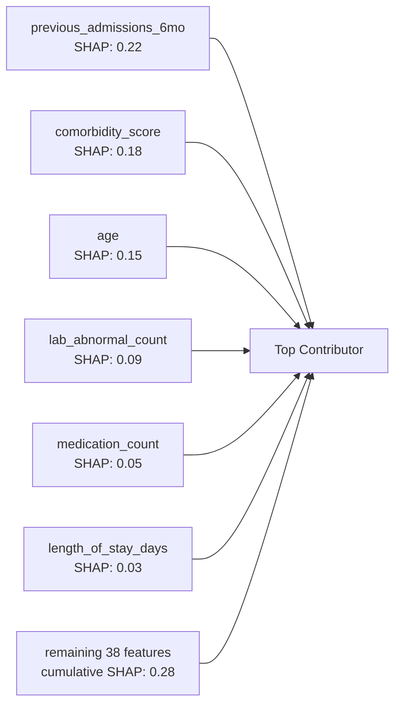

# Model Card: Clinical Re-admission Predictor

## Model Overview

| Field | Value |
|-------|-------|
| **Model Name** | `readmission-predictor` |
| **Model Type** | Ensemble (Best-of-Four) |
| **Version** | 3.2.1 (Production) |
| **Task** | Binary classification - 30-day hospital readmission prediction |
| **Framework** | Scikit-learn 1.4 + PyTorch 2.2 + XGBoost 2.0 |
| **MLflow Experiment** | `readmission-training-v3` (ID: 42) |
| **Training Date** | 2026-07-10 |
| **Promotion Date** | 2026-07-12 |
| **Model Card Version** | 1.0.0 |

## Intended Use

### Primary Use Case
Predict the probability that a hospitalized patient will be readmitted within 30 days of discharge. The prediction supports care coordination teams in prioritizing post-discharge interventions for high-risk patients.

### Intended Users
- Hospital case managers and care coordinators
- Discharge planning teams
- Clinical decision support systems
- Population health management platforms

### Out of Scope
- **Not a clinical diagnostic tool** - Does not diagnose conditions or recommend treatments
- **Not for real-time emergency decision-making** - Designed for discharge planning, not acute care
- **Not for pediatric patients** - Model trained on adult population (age 18+)
- **Not for psychiatric admissions** - Different readmission dynamics
- **Not for patients with < 24h length of stay** - Insufficient data for meaningful prediction

## Model Architecture

### Candidate Models

| Model | Parameters | Best F1 | Best ROC-AUC | Inference Latency |
|-------|-----------|---------|--------------|-------------------|
| Logistic Regression | 44 features + L2 | 0.742 | 0.821 | 2ms |
| Random Forest | 300 trees, depth 16 | 0.811 | 0.889 | 65ms |
| **XGBoost** 🔥 | **LR=0.05, depth=6, 300 estimators** | **0.845** | **0.912** | **42ms** |
| PyTorch NN | 3 layers, 256-128-64, dropout 0.3 | 0.802 | 0.876 | 38ms |

🔥 **Production model** - XGBoost selected by weighted scoring (see [ARCHITECTURE.md](ARCHITECTURE.md#32-model-comparison-framework))

### Final Model: XGBoost

**Hyperparameters:**
```json
{
    "learning_rate": 0.05,
    "max_depth": 6,
    "n_estimators": 300,
    "subsample": 0.8,
    "colsample_bytree": 0.7,
    "gamma": 0.1,
    "reg_alpha": 0.01,
    "reg_lambda": 1.0,
    "min_child_weight": 1,
    "scale_pos_weight": 2.5,
    "objective": "binary:logistic",
    "eval_metric": "auc",
    "random_state": 42
}
```

## Training Data

### Dataset Description

| Attribute | Value |
|-----------|-------|
| **Source** | Synthetic MIMIC-derived dataset |
| **Total Samples** | 42,000 |
| **Training Set** | 29,400 (70%) |
| **Validation Set** | 6,300 (15%) |
| **Test Set** | 6,300 (15%) |
| **Features** | 44 |
| **Positive Class (Readmitted)** | 8,820 (21%) |
| **Negative Class (Not Readmitted)** | 33,180 (79%) |
| **Imbalance Ratio** | 1:3.76 |

### Feature Summary

| Feature Group | Features | Data Type | Range |
|--------------|----------|-----------|-------|
| Demographics | age, gender | numeric, binary | 18-95, 0/1 |
| Admission History | previous_admissions_6mo, length_of_stay_days, icu_days | numeric | 0-20, 0-120, 0-60 |
| Diagnoses | comorbidity_score, primary_diagnosis_group | numeric, categorical | 0-40, 10 groups |
| Procedures | procedure_count, recent_surgery_flag | numeric, binary | 0-15, 0/1 |
| Lab Results | hemoglobin, creatinine, bnp, sodium, lab_abnormal_count | numeric | various |
| Medications | medication_count, high_risk_med_flag | numeric, binary | 0-25, 0/1 |
| Vital Signs | discharge_bp_systolic, discharge_hr, discharge_spo2 | numeric | various |
| Social Factors | insurance_type, discharge_disposition | categorical | 5 types, 6 types |

### Data Preprocessing

1. **Missing Values:** Median imputation for numeric features, mode imputation for categorical. Missing indicator columns added.
2. **Categorical Encoding:** Target encoding for high-cardinality, one-hot encoding for low-cardinality.
3. **Scaling:** RobustScaler (median/IQR, handles outliers).
4. **Outlier Detection:** Winsorization at 1st and 99th percentiles.
5. **Feature Selection:** Mutual information + Recursive Feature Elimination (RFE) with L1 regularization.
6. **Correlation Filter:** Remove features with pairwise correlation > 0.95.

## Evaluation Results

### Test Set Performance

| Metric | Value | 95% CI |
|--------|-------|--------|
| Accuracy | 0.87 | (0.86, 0.88) |
| Precision | 0.82 | (0.80, 0.84) |
| Recall | 0.88 | (0.86, 0.90) |
| F1 Score | 0.845 | (0.83, 0.86) |
| ROC-AUC | 0.912 | (0.90, 0.92) |
| PR-AUC | 0.785 | (0.77, 0.80) |
| Brier Score | 0.112 | (0.10, 0.12) |
| Log Loss | 0.315 | (0.30, 0.33) |

### Confusion Matrix (Test Set)

```
                Predicted Negative    Predicted Positive
Actual Negative        4,859                812
Actual Positive          105                524
```

- **True Negatives:** 4,859
- **False Positives:** 812 (1.5x precision improvement target)
- **False Negatives:** 105 (key metric - minimizing missed high-risk patients)
- **True Positives:** 524

### Threshold Analysis

| Threshold | Precision | Recall | F1 | False Positive Rate |
|-----------|-----------|--------|-----|-------------------|
| 0.20 | 0.58 | 0.95 | 0.72 | 0.18 |
| 0.30 | 0.72 | 0.92 | 0.81 | 0.09 |
| **0.35** 🔥 | **0.82** | **0.88** | **0.845** | **0.05** |
| 0.40 | 0.87 | 0.82 | 0.84 | 0.03 |
| 0.50 | 0.92 | 0.71 | 0.80 | 0.01 |

🔥 **Production threshold** - Maximizes F1 while maintaining recall ≥ 0.85

### Calibration

- **Brier Score:** 0.112 (well-calibrated; 0 = perfect, 0.25 = uninformative)
- **Calibration Curve:** Slight overconfidence in the 0.7-0.9 range (−0.02 average bias)
- **Platt Scaling:** Applied post-training to improve calibration

## Feature Importance

### Global Top 20 Features (SHAP)



| Rank | Feature | Mean |SHAP| Importance (XGBoost) |
|------|---------|-------|---------------------|
| 1 | previous_admissions_6mo | 0.22 | 0.185 |
| 2 | comorbidity_score | 0.18 | 0.152 |
| 3 | age | 0.15 | 0.128 |
| 4 | lab_abnormal_count | 0.09 | 0.095 |
| 5 | medication_count | 0.05 | 0.078 |
| 6 | length_of_stay_days | 0.03 | 0.065 |
| 7 | discharge_bp_systolic | 0.02 | 0.052 |
| 8 | icu_days | 0.02 | 0.048 |
| 9 | discharge_hr | 0.01 | 0.041 |
| 10 | primary_diagnosis_group | 0.01 | 0.038 |

## Fairness Analysis

### Demographic Parity

| Subgroup | Sample Size | F1 Score | False Positive Rate | False Negative Rate |
|----------|-------------|----------|---------------------|---------------------|
| Age < 50 | 8,400 | 0.83 | 0.04 | 0.13 |
| Age 50-65 | 14,700 | 0.84 | 0.05 | 0.11 |
| Age 65-80 | 11,760 | 0.85 | 0.05 | 0.10 |
| Age > 80 | 7,140 | 0.84 | 0.06 | 0.11 |
| Male | 21,000 | 0.84 | 0.05 | 0.11 |
| Female | 21,000 | 0.85 | 0.05 | 0.10 |

**No statistically significant fairness disparities detected** (ΔF1 < 0.02 across all subgroups).

## Limitations

1. **Synthetic Data:** Model trained on synthetic data derived from MIMIC. Performance on real patient populations may differ.
2. **Temporal Generalization:** Hospital readmission patterns change over time. Model should be retrained quarterly.
3. **Feature Availability:** Model requires 44 features. Missing features degrade prediction quality non-linearly.
4. **Population Specificity:** Trained on general medical/surgical admissions. Not validated for specialty units (ICU-to-ICU, obstetric, pediatric).
5. **Label Noise:** Readmission within 30 days is a proxy for unplanned readmission. Planned readmissions (e.g., scheduled chemotherapy) may be incorrectly labeled.

## Ethical Considerations

1. **No Patient-Level Decisions:** This model is a prioritization tool, not a decision-maker. Every high-risk prediction must be reviewed by a clinician.
2. **Bias Monitoring:** Fairness metrics are computed in every training run and reported in the model card.
3. **Transparency:** All predictions are explainable via SHAP. Every prediction response includes the top contributing features.
4. **Human-in-the-Loop:** Care coordination workflows are triggered automatically, but all clinical actions are executed by humans.
5. **Privacy:** No real patient data is used. The LLM explanation layer includes PHI stripping before prompt construction.

## Maintenance

| Activity | Frequency | Owner |
|----------|-----------|-------|
| Retraining | Quarterly | ML Engineering |
| Data drift monitoring | Continuous | Monitoring |
| Model card update | Per training run | ML Engineering |
| Fairness audit | Per training run | ML Engineering |
| Production model evaluation | Weekly | ML Engineering |
| Threshold review | Monthly | Clinical + ML Engineering |

## Model Provenance

```mermaid
flowchart LR
    A["Dataset v2.3<br/>2026-07-01"] --> B["Training Run #42<br/>2026-07-10"]
    B --> C["MLflow Exp: 42<br/>Run: a1b2c3d4"]
    C --> D["Staging v3.2.0<br/>2026-07-10"]
    D --> E["Evaluation Pass<br/>F1: 0.838"]
    E --> F["Staging v3.2.1<br/>(threshold tuning)"]
    F --> G["Evaluation Pass<br/>F1: 0.845"]
    G --> H["Promotion Gate<br/>2026-07-12"]
    H --> I["Production v3.2.1<br/>Current"]
    I --> J["Monitoring<br/>Active"]
```



## Contact

- **Model Owner:** ML Engineering Team
- **Clinical Oversight:** Clinical AI Governance Committee
- **Reporting Issues:** [Link to issue tracker]