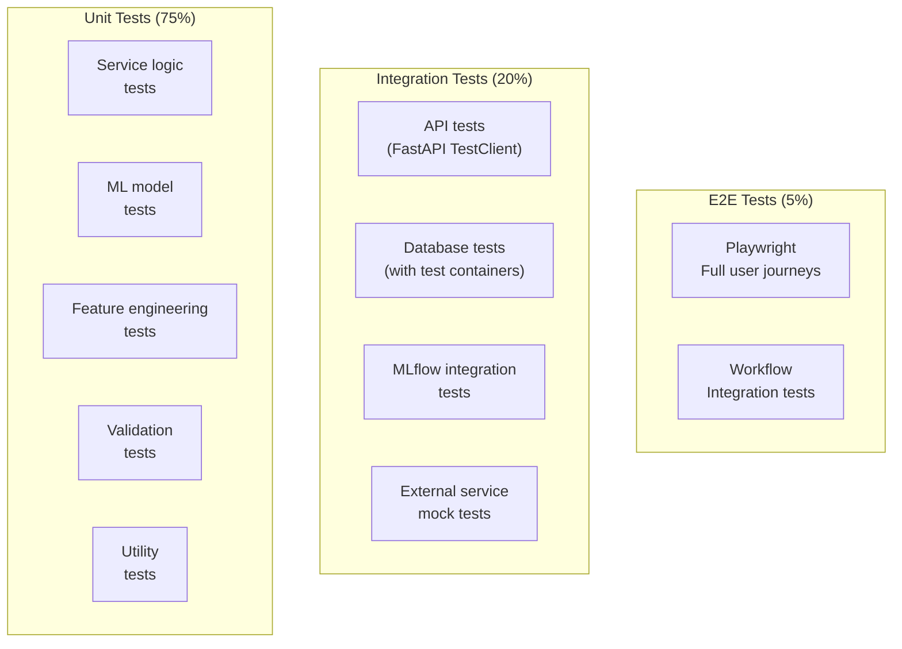

# Testing Strategy

## Test Pyramid



## 1. Unit Tests

### Location: `services/*/tests/unit/`

### Test Categories

#### 1.1 Service Logic Tests

```python
# tests/unit/test_prediction_service.py
import pytest
from datetime import datetime, timezone
from prediction_service.models import PredictionResult, RiskLevel

class TestPredictionResult:
    def test_high_risk_classification(self):
        result = PredictionResult(
            risk_score=0.72,
            threshold=0.35,
            model_version="3.2.1"
        )
        assert result.risk_level == RiskLevel.HIGH
        assert result.risk_score > result.threshold

    def test_low_risk_classification(self):
        result = PredictionResult(
            risk_score=0.12,
            threshold=0.35,
            model_version="3.2.1"
        )
        assert result.risk_level == RiskLevel.LOW
        assert result.risk_score < result.threshold

    def test_boundary_risk_classification(self):
        result = PredictionResult(
            risk_score=0.35,
            threshold=0.35,
            model_version="3.2.1"
        )
        assert result.risk_level == RiskLevel.HIGH  # >= threshold

    def test_confidence_calculation(self):
        result = PredictionResult(
            risk_score=0.85,
            threshold=0.35,
            model_version="3.2.1"
        )
        # Confidence should be higher for extreme scores
        assert result.confidence > 0.5
        assert result.confidence <= 1.0

    def test_prediction_timestamp_is_utc(self):
        result = PredictionResult(
            risk_score=0.5,
            threshold=0.35,
            model_version="3.2.1"
        )
        assert result.prediction_timestamp.tzinfo is not None
        assert result.prediction_timestamp.tzinfo == timezone.utc
```

#### 1.2 ML Model Tests

```python
# tests/unit/test_ml_models.py
import pytest
import numpy as np
from sklearn.linear_model import LogisticRegression
from sklearn.ensemble import RandomForestClassifier
from xgboost import XGBClassifier
import torch
import torch.nn as nn

class TestModelContracts:
    """All models must implement the same interface."""

    @pytest.fixture
    def sample_features(self):
        np.random.seed(42)
        return np.random.randn(10, 44)

    @pytest.mark.parametrize("model", [
        LogisticRegression(C=1.0, max_iter=1000, random_state=42),
        RandomForestClassifier(n_estimators=100, random_state=42),
        XGBClassifier(n_estimators=100, random_state=42, eval_metric="logloss"),
    ])
    def test_sklearn_models_output_probabilities(self, model, sample_features):
        X = np.random.randn(100, 44)
        y = np.random.randint(0, 2, 100)
        model.fit(X, y)

        probabilities = model.predict_proba(sample_features)
        assert probabilities.shape == (10, 2)
        assert np.all(probabilities >= 0)
        assert np.all(probabilities <= 1)
        np.testing.assert_array_almost_equal(
            probabilities.sum(axis=1), np.ones(10)
        )

    def test_pytorch_model_output_probabilities(self, sample_features):
        model = SimpleNN(input_dim=44, hidden_dims=[256, 128, 64], dropout=0.3)
        X_tensor = torch.tensor(sample_features, dtype=torch.float32)
        model.eval()

        with torch.no_grad():
            logits = model(X_tensor)
            probabilities = torch.sigmoid(logits)

        assert probabilities.shape == (10, 1)
        assert torch.all(probabilities >= 0)
        assert torch.all(probabilities <= 1)
```

#### 1.3 Feature Engineering Tests

```python
# tests/unit/test_feature_pipeline.py
import pytest
import pandas as pd
import numpy as np
from sklearn.pipeline import Pipeline
from sklearn.preprocessing import RobustScaler, OneHotEncoder
from sklearn.impute import SimpleImputer

class TestFeaturePipeline:
    def test_pipeline_handles_missing_values(self):
        data = pd.DataFrame({
            "age": [25, None, 35, 40, None],
            "comorbidity_score": [2.0, 5.0, None, 3.0, 4.0],
            "gender": ["M", "F", None, "F", "M"]
        })
        pipeline = build_feature_pipeline()
        pipeline.fit(data)
        transformed = pipeline.transform(data)

        assert not np.any(np.isnan(transformed))
        assert transformed.shape[0] == 5

    def test_pipeline_produces_expected_features(self):
        data = generate_sample_patients(100)
        pipeline = build_feature_pipeline()
        pipeline.fit(data)
        transformed = pipeline.transform(data)

        # After encoding, we expect 44 features
        assert transformed.shape[1] == 44

    def test_pipeline_is_reproducible(self):
        data = generate_sample_patients(100)
        pipeline = build_feature_pipeline(random_state=42)
        pipeline.fit(data)

        result1 = pipeline.transform(data)
        result2 = pipeline.transform(data)

        np.testing.assert_array_almost_equal(result1, result2)

    def test_pipeline_serialization_roundtrip(self, tmp_path):
        import joblib

        data = generate_sample_patients(100)
        pipeline = build_feature_pipeline()
        pipeline.fit(data)

        path = tmp_path / "pipeline.pkl"
        joblib.dump(pipeline, path)
        loaded = joblib.load(path)

        original_result = pipeline.transform(data)
        loaded_result = loaded.transform(data)

        np.testing.assert_array_almost_equal(original_result, loaded_result)
```

#### 1.4 Validation Tests

```python
# tests/unit/test_validation.py
import pytest
from pydantic import ValidationError
from api_gateway.schemas import PredictionRequest, PatientCreate

class TestPredictionRequestValidation:
    def test_valid_request(self):
        request = PredictionRequest(
            patient_id="pat_abc123",
            features={
                "age": 72,
                "previous_admissions": 3,
                "comorbidity_score": 7.5,
                "lab_result_abnormal": 1,
                "medication_count": 8,
                "length_of_stay_days": 14
            }
        )
        assert request.patient_id == "pat_abc123"

    def test_invalid_age(self):
        with pytest.raises(ValidationError):
            PredictionRequest(
                patient_id="pat_abc123",
                features={
                    "age": -5,
                    "previous_admissions": 3,
                    "comorbidity_score": 7.5
                }
            )

    def test_missing_required_features(self):
        with pytest.raises(ValidationError):
            PredictionRequest(
                patient_id="pat_abc123",
                features={"age": 72}  # Missing required features
            )

    def test_invalid_patient_id_format(self):
        with pytest.raises(ValidationError):
            PredictionRequest(
                patient_id="invalid_format",
                features={"age": 72, "previous_admissions": 3, "comorbidity_score": 5.0}
            )
```

## 2. Integration Tests

### Location: `services/*/tests/integration/`

#### 2.1 API Tests

```python
# tests/integration/test_api.py
from fastapi.testclient import TestClient
from api_gateway.main import app

client = TestClient(app)

class TestPredictionAPI:
    def test_health_endpoint(self):
        response = client.get("/health")
        assert response.status_code == 200
        assert response.json()["status"] == "healthy"

    def test_unauthorized_access(self):
        response = client.post("/api/v1/predict", json={})
        assert response.status_code == 401

    def test_authorized_prediction(self, auth_headers, sample_patient):
        response = client.post(
            "/api/v1/predict",
            json={"patient_id": sample_patient["id"], "features": sample_patient["features"]},
            headers=auth_headers
        )
        assert response.status_code == 200
        data = response.json()
        assert "risk_score" in data["prediction"]
        assert "risk_level" in data["prediction"]
        assert "shap_values" in data["explanation"]

    def test_batch_prediction(self, auth_headers, sample_patients):
        response = client.post(
            "/api/v1/predict/batch",
            json={"patients": sample_patients},
            headers=auth_headers
        )
        assert response.status_code == 200
        data = response.json()
        assert len(data["predictions"]) == len(sample_patients)
        assert "summary" in data
```

#### 2.2 Database Tests

```python
# tests/integration/test_database.py
import pytest
from sqlalchemy import text
from api_gateway.database import get_db

class TestDatabaseConnection:
    async def test_connection(self, test_db):
        result = await test_db.execute(text("SELECT 1"))
        assert result.scalar() == 1

    async def test_create_patient(self, test_db):
        result = await test_db.execute(
            text("""
                INSERT INTO patients (mrn, first_name, last_name, date_of_birth, age)
                VALUES (:mrn, :first_name, :last_name, :dob, :age)
                RETURNING id
            """),
            {
                "mrn": "MRN-TEST-001",
                "first_name": "Test",
                "last_name": "Patient",
                "dob": "1950-01-15",
                "age": 76
            }
        )
        patient_id = result.scalar()
        assert patient_id is not None

    async def test_create_prediction(self, test_db, test_patient):
        result = await test_db.execute(
            text("""
                INSERT INTO predictions (patient_id, model_version_id, risk_score, risk_level, confidence, threshold, features)
                VALUES (:patient_id, :model_version_id, :risk_score, :risk_level, :confidence, :threshold, :features::jsonb)
                RETURNING id
            """),
            {
                "patient_id": test_patient["id"],
                "model_version_id": test_patient["model_version_id"],
                "risk_score": 0.72,
                "risk_level": "HIGH",
                "confidence": 0.89,
                "threshold": 0.35,
                "features": '{"age": 72}'
            }
        )
        prediction_id = result.scalar()
        assert prediction_id is not None
```

#### 2.3 MLflow Integration Tests

```python
# tests/integration/test_mlflow.py
import pytest
import mlflow
from mlflow.tracking import MlflowClient

class TestMLflowIntegration:
    def test_create_experiment(self, mlflow_client):
        experiment_id = mlflow.create_experiment(
            f"test_experiment_{pytest.test_id}",
            tags={"project": "test", "purpose": "integration_test"}
        )
        assert experiment_id is not None

    def test_log_metrics_and_params(self, mlflow_client):
        with mlflow.start_run() as run:
            mlflow.log_param("test_param", "value")
            mlflow.log_metric("test_metric", 0.95)

            # Verify
            run_data = mlflow_client.get_run(run.info.run_id)
            assert run_data.data.params["test_param"] == "value"
            assert run_data.data.metrics["test_metric"] == 0.95

    def test_register_model(self, mlflow_client, trained_model):
        with mlflow.start_run() as run:
            mlflow.sklearn.log_model(
                trained_model,
                "model",
                registered_model_name="test-readmission-predictor"
            )

        model_version = mlflow_client.get_latest_versions(
            "test-readmission-predictor",
            stages=["None"]
        )[0]
        assert model_version is not None
```

## 3. ML-Specific Tests

### Location: `tests/ml/`

#### 3.1 Model Performance Tests

```python
# tests/ml/test_model_performance.py
import pytest
import numpy as np
from sklearn.metrics import f1_score, roc_auc_score

class TestModelPerformance:
    MIN_F1_SCORE = 0.70
    MIN_ROC_AUC = 0.80
    MAX_LATENCY_MS = 100

    def test_model_meets_minimum_f1(self, trained_model, test_data):
        X_test, y_test = test_data
        y_pred = trained_model.predict(X_test)
        f1 = f1_score(y_test, y_pred)
        assert f1 >= self.MIN_F1_SCORE, f"F1={f1:.3f} < {self.MIN_F1_SCORE}"

    def test_model_meets_minimum_roc_auc(self, trained_model, test_data):
        X_test, y_test = test_data
        y_prob = trained_model.predict_proba(X_test)[:, 1]
        roc_auc = roc_auc_score(y_test, y_prob)
        assert roc_auc >= self.MIN_ROC_AUC, f"ROC-AUC={roc_auc:.3f}"

    def test_inference_latency(self, trained_model, sample_features):
        import time
        start = time.time()
        for _ in range(100):
            trained_model.predict_proba(sample_features)
        avg_latency_ms = (time.time() - start) / 100 * 1000
        assert avg_latency_ms <= self.MAX_LATENCY_MS

    def test_prediction_distribution(self, trained_model, test_data):
        """Test that predictions are not degenerate (all same class)."""
        X_test, _ = test_data
        y_pred = trained_model.predict(X_test)
        unique_classes = np.unique(y_pred)
        assert len(unique_classes) > 1, "Model predicts only one class"

    def test_feature_importance_not_empty(self, trained_model):
        if hasattr(trained_model, "feature_importances_"):
            importances = trained_model.feature_importances_
            assert len(importances) > 0
            assert np.all(importances >= 0)
```

#### 3.2 SHAP Tests

```python
# tests/ml/test_shap_explainability.py
import pytest
import shap
import numpy as np

class TestSHAPExplanations:
    def test_shap_values_shape(self, trained_model, sample_features):
        explainer = shap.TreeExplainer(trained_model)
        shap_values = explainer.shap_values(sample_features)
        assert shap_values.shape == sample_features.shape

    def test_shap_base_value(self, trained_model, sample_features):
        explainer = shap.TreeExplainer(trained_model)
        shap_values = explainer.shap_values(sample_features)
        expected_sum = explainer.expected_value + shap_values.sum(axis=1)
        predicted = trained_model.predict_proba(sample_features)[:, 1]
        np.testing.assert_array_almost_equal(expected_sum, predicted, decimal=3)

    def test_top_features_identified(self, trained_model, sample_features):
        explainer = shap.TreeExplainer(trained_model)
        shap_values = explainer.shap_values(sample_features)

        # Top 3 features for first sample
        feature_importance = np.abs(shap_values[0])
        top_3_indices = np.argsort(feature_importance)[-3:]

        assert len(top_3_indices) == 3
        assert np.all(feature_importance[top_3_indices] > 0)
```

## 4. Workflow Tests

### Location: `tests/workflow/`

```python
# tests/workflow/test_care_coordination.py
import pytest
from temporalio.testing import WorkflowEnvironment
from temporalio.worker import Worker
from workflow_service.workflows import CareCoordinationWorkflow

class TestCareCoordinationWorkflow:
    @pytest.mark.asyncio
    async def test_workflow_completes_successfully(self):
        async with await WorkflowEnvironment.start_time_skipping() as env:
            async with Worker(
                env.client,
                task_queue="care-coordination",
                workflows=[CareCoordinationWorkflow],
                activities=[mock_create_appointment, mock_send_notification]
            ):
                result = await env.client.execute_workflow(
                    CareCoordinationWorkflow.run,
                    args=[{"patient_id": "pat_123", "risk_score": 0.72}],
                    id="wf-test-1",
                    task_queue="care-coordination"
                )
                assert result["status"] == "ACTIVE"
                assert result["appointment_id"] is not None

    @pytest.mark.asyncio
    async def test_workflow_retries_on_failure(self):
        async with await WorkflowEnvironment.start_time_skipping() as env:
            call_count = 0

            async def failing_activity(*args):
                nonlocal call_count
                call_count += 1
                if call_count < 3:
                    raise Exception("Temporary failure")
                return {"status": "success"}

            async with Worker(
                env.client,
                task_queue="care-coordination",
                workflows=[CareCoordinationWorkflow],
                activities=[failing_activity]
            ):
                result = await env.client.execute_workflow(
                    CareCoordinationWorkflow.run,
                    args=[{"patient_id": "pat_123", "risk_score": 0.72}],
                    id="wf-test-2",
                    task_queue="care-coordination"
                )
                assert call_count == 3
                assert result["status"] == "ACTIVE"
```

## 5. E2E Tests (Playwright)

### Location: `frontend/e2e/`

```typescript
// e2e/dashboard.spec.ts
import { test, expect } from '@playwright/test';

test.describe('Dashboard', () => {
  test.beforeEach(async ({ page }) => {
    await page.goto('/login');
    await page.fill('[data-testid="email-input"]', 'clinician@hospital.org');
    await page.fill('[data-testid="password-input"]', 'Password123!');
    await page.click('[data-testid="login-button"]');
    await page.waitForURL('/dashboard');
  });

  test('displays correct dashboard summary', async ({ page }) => {
    await expect(page.locator('[data-testid="total-patients"]')).toBeVisible();
    await expect(page.locator('[data-testid="high-risk-count"]')).toBeVisible();
    await expect(page.locator('[data-testid="workflow-completion-rate"]')).toBeVisible();

    const highRisk = await page.locator('[data-testid="high-risk-count"]').textContent();
    expect(Number(highRisk)).toBeGreaterThanOrEqual(0);
  });

  test('navigates to patient list', async ({ page }) => {
    await page.click('[data-testid="patients-link"]');
    await page.waitForURL('/patients');
    await expect(page.locator('[data-testid="patient-table"]')).toBeVisible();
  });

  test('performs prediction on patient', async ({ page }) => {
    await page.goto('/patients/pat_abc123');
    await page.click('[data-testid="predict-button"]');
    await page.waitForSelector('[data-testid="risk-score"]');

    await expect(page.locator('[data-testid="risk-score"]')).toBeVisible();
    await expect(page.locator('[data-testid="shap-plot"]')).toBeVisible();
    await expect(page.locator('[data-testid="llm-explanation"]')).toBeVisible();
  });
});

test.describe('Workflow Monitoring', () => {
  test('displays workflow timeline', async ({ page }) => {
    await page.goto('/workflows/wf_xyz789');
    await expect(page.locator('[data-testid="workflow-timeline"]')).toBeVisible();
    await expect(page.locator('[data-testid="workflow-status"]')).toContainText('COMPLETED');
  });
});
```

## 6. Coverage Requirements

| Test Type | Target Coverage | Critical Paths |
|-----------|----------------|----------------|
| Unit Tests | 90%+ | 100% |
| Integration Tests | 80%+ | 100% |
| API Tests | 100% of endpoints | All auth scenarios |
| ML Tests | 100% of model contracts | All model types |
| Workflow Tests | All workflow paths | Retry, failure, escalation |
| E2E Tests | All critical user journeys | Login, predict, workflow |

## 7. Test Fixtures

### Location: `tests/conftest.py`

```python
import pytest
import asyncio
from typing import AsyncGenerator
from sqlalchemy.ext.asyncio import create_async_engine, AsyncSession
from testcontainers.postgres import PostgresContainer

@pytest.fixture(scope="session")
def event_loop():
    loop = asyncio.new_event_loop()
    yield loop
    loop.close()

@pytest.fixture(scope="session")
async def postgres_container():
    with PostgresContainer("postgres:16-alpine") as postgres:
        yield postgres

@pytest.fixture
async def test_db(postgres_container) -> AsyncGenerator[AsyncSession, None]:
    engine = create_async_engine(postgres_container.get_connection_url())
    async with engine.begin() as conn:
        # Create tables
        await conn.run_sync(Base.metadata.create_all)

    async with AsyncSession(engine) as session:
        yield session

    async with engine.begin() as conn:
        await conn.run_sync(Base.metadata.drop_all)
```

## 8. CI Test Execution

```yaml
# .github/workflows/test.yml
name: Test Suite

on:
  pull_request:
    paths:
      - 'services/**'
      - 'frontend/**'
      - 'tests/**'

jobs:
  unit-tests:
    runs-on: ubuntu-latest
    strategy:
      matrix:
        service: [api-gateway, prediction, training, llm, workflow]
    steps:
      - uses: actions/checkout@v4
      - uses: actions/setup-python@v5
        with: { python-version: '3.12' }
      - run: pip install -r services/${{ matrix.service }}/requirements-dev.txt
      - run: pytest services/${{ matrix.service }}/tests/unit/ -v --cov=services/${{ matrix.service }} --cov-fail-under=90

  integration-tests:
    runs-on: ubuntu-latest
    services:
      postgres:
        image: postgres:16-alpine
        env:
          POSTGRES_DB: test
          POSTGRES_USER: test
          POSTGRES_PASSWORD: test
        ports: ["5432:5432"]
    steps:
      - uses: actions/checkout@v4
      - uses: actions/setup-python@v5
        with: { python-version: '3.12' }
      - run: pip install -r services/api-gateway/requirements-dev.txt
      - run: pytest services/api-gateway/tests/integration/ -v --cov-fail-under=80

  e2e-tests:
    runs-on: ubuntu-latest
    steps:
      - uses: actions/checkout@v4
      - uses: actions/setup-node@v4
        with: { node-version: '20' }
      - run: npm ci
      - run: npx playwright install --with-deps
      - run: npx playwright test
      - uses: actions/upload-artifact@v4
        if: failure()
        with:
          name: playwright-report
          path: playwright-report/
```