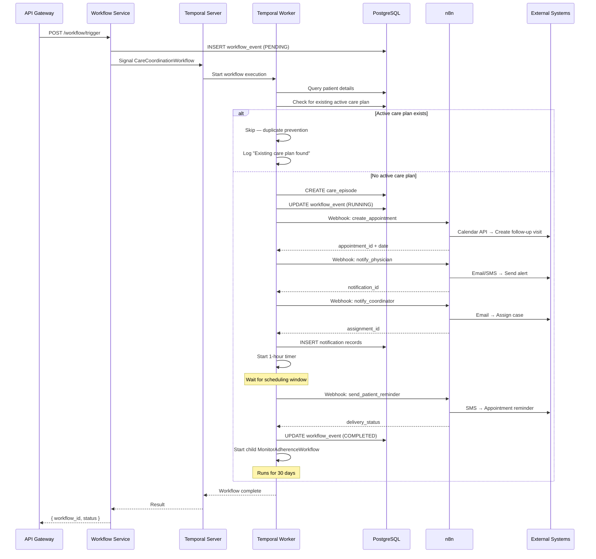
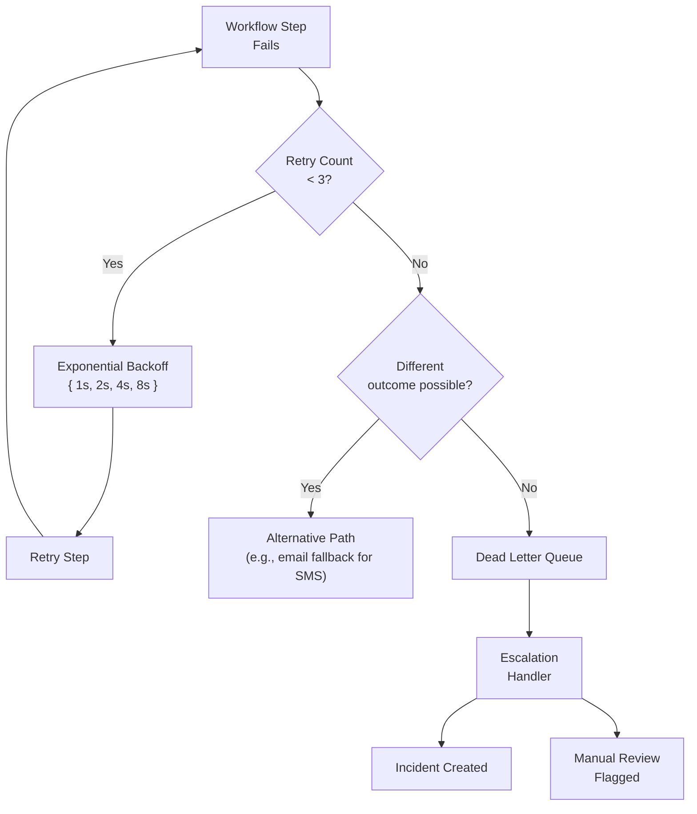

# Workflow Orchestration Design

## Architecture Overview

The platform uses a dual orchestration strategy:
- **Temporal** for durable, long-running, stateful ML workflows
- **n8n** for rapid, event-driven care coordination automations

## Temporal Workflows

### Workflow: Care Coordination

**Trigger:** High-risk prediction (risk_score ≥ 0.35)
**Duration:** Up to 30 days (monitoring window)
**Type:** Durable execution with compensation



### Workflow: Model Retraining

**Trigger:** Scheduled (weekly) or manual
**Duration:** 30-60 minutes
**Type:** Durable execution with retry

```mermaid
sequenceDiagram
    participant SCH as Scheduler (Cron)
    participant TEMP as Temporal Server
    participant WKR as Temporal Worker
    participant TS as Training Service
    participant ML as MLflow
    participant DB as PostgreSQL

    SCH->>TEMP: Start ModelRetrainingWorkflow
    TEMP->>WKR: Execute workflow

    WKR->>WKR: Load dataset version config
    WKR->>WKR: Check if training slot available
    alt Training already in progress
        WKR->>WKR: Skip — deduplication
        WKR->>DB: Log skipped run
    else
        WKR->>TS: POST /training/start
        TS->>ML: Create experiment run
        TS->>TS: Train all 4 models
        TS->>ML: Log metrics + params + artifacts
        TS-->>WKR: experiment_id

        WKR->>WKR: Wait for completion (polling)
        loop Every 30 seconds
            WKR->>TS: GET /training/status/{experiment_id}
            alt Status == COMPLETED
                break
            else Status == FAILED
                WKR->>WKR: Retry (max 3)
                alt Retries exhausted
                    WKR->>DB: Log failure
                    WKR->>WKR: Escalate to engineering
                end
            end
        end

        WKR->>ML: Get best model from comparison
        WKR->>ML: Register model to Staging
        WKR->>DB: INSERT model_version record
        WKR->>WKR: Generate model card
    end
```

### Temporal Workflow Definitions (Python Pseudocode)

```python
from temporalio import workflow
from temporalio.common import RetryPolicy
from datetime import timedelta

@workflow.defn
class CareCoordinationWorkflow:
    @workflow.run
    async def run(self, payload: CareCoordinationPayload) -> CareCoordinationResult:
        # Step 1: Check for duplicate
        existing = await workflow.execute_activity(
            check_active_care_plan,
            payload.patient_id,
            start_to_close_timeout=timedelta(seconds=5)
        )
        if existing:
            return CareCoordinationResult(skipped=True, reason="Active plan exists")

        # Step 2: Create care episode
        episode = await workflow.execute_activity(
            create_care_episode,
            args=[payload.patient_id, payload.risk_score],
            retry_policy=RetryPolicy(max_retries=3, backoff_coefficient=2.0)
        )

        # Step 3: Schedule appointment (n8n)
        appointment = await workflow.execute_activity(
            trigger_n8n_workflow,
            args=["create_appointment", {"patient_id": payload.patient_id}],
            retry_policy=RetryPolicy(max_retries=3)
        )

        # Step 4: Notify care team (n8n)
        notifications = await workflow.execute_activity(
            trigger_n8n_workflow,
            args=["notify_care_team", {
                "patient_id": payload.patient_id,
                "risk_score": payload.risk_score,
                "appointment_date": appointment.date
            }],
            retry_policy=RetryPolicy(max_retries=3)
        )

        # Step 5: Wait 1 hour before patient reminder
        await workflow.sleep(timedelta(hours=1))

        # Step 6: Send patient reminder (n8n)
        reminder = await workflow.execute_activity(
            trigger_n8n_workflow,
            args=["send_patient_reminder", {
                "patient_id": payload.patient_id,
                "appointment_date": appointment.date
            }],
            retry_policy=RetryPolicy(max_retries=3)
        )

        # Step 7: Start monitoring child workflow
        await workflow.start_child_workflow(
            MonitorAdherenceWorkflow.run,
            args=[payload.patient_id, episode.id],
            execution_timeout=timedelta(days=30)
        )

        return CareCoordinationResult(
            episode_id=episode.id,
            appointment_id=appointment.id,
            status="ACTIVE",
            notifications_sent=notifications.count
        )
```

## n8n Workflows

### Workflow 1: Create Follow-Up Appointment

**Trigger:** Webhook from Temporal worker
**Integration:** Google Calendar API / Outlook Calendar API

```json
{
    "name": "Create Follow-Up Appointment",
    "nodes": [
        {
            "name": "Webhook Receiver",
            "type": "n8n-nodes-base.webhook",
            "parameters": {
                "path": "create-appointment",
                "responseMode": "responseNode"
            }
        },
        {
            "name": "Get Patient Details",
            "type": "n8n-nodes-base.httpRequest",
            "parameters": {
                "url": "={{$env.API_GATEWAY_URL}}/api/v1/patients/{{$json.patient_id}}",
                "options": {
                    "headers": {
                        "Authorization": "Bearer {{$env.API_TOKEN}}"
                    }
                }
            }
        },
        {
            "name": "Get Provider Schedule",
            "type": "n8n-nodes-base.postgres",
            "parameters": {
                "query": "SELECT id, name, next_available_slot FROM providers WHERE specialty = $1 AND is_active = true ORDER BY next_available_slot ASC LIMIT 1",
                "params": ["={{$json.specialty}}"]
            }
        },
        {
            "name": "Create Calendar Event",
            "type": "n8n-nodes-base.googleCalendar",
            "parameters": {
                "operation": "create",
                "calendarId": "primary",
                "summary": "Follow-up: {{$json.patient_name}} - Readmission Risk Follow-up",
                "description": "High readmission risk patient follow-up. Risk Score: {{$json.risk_score}}. Please review discharge plan and assess recovery progress.",
                "start": {
                    "dateTime": "={{$json.appointment_time}}",
                    "timeZone": "America/New_York"
                },
                "end": {
                    "dateTime": "={{DateTime.add($json.appointment_time, 30, 'minutes')}}",
                    "timeZone": "America/New_York"
                }
            }
        },
        {
            "name": "Log Appointment",
            "type": "n8n-nodes-base.postgres",
            "parameters": {
                "query": "INSERT INTO appointments (patient_id, provider_id, appointment_time, risk_score, created_at) VALUES ($1, $2, $3, $4, NOW()) RETURNING id",
                "params": ["={{$json.patient_id}}", "={{$json.provider_id}}", "={{$json.appointment_time}}", "={{$json.risk_score}}"]
            }
        },
        {
            "name": "Respond",
            "type": "n8n-nodes-base.respondToWebhook",
            "parameters": {
                "respondWith": "json",
                "responseBody": {
                    "appointment_id": "={{$json.id}}",
                    "date": "={{$json.appointment_time}}",
                    "provider": "={{$json.provider_name}}",
                    "status": "scheduled"
                }
            }
        }
    ]
}
```

### Workflow 2: Notify Care Team

**Trigger:** Webhook from Temporal worker
**Integrations:** Email (Gmail/SMTP), SMS (Twilio)

**Channels:**

| Role | Channel | Priority | Template |
|------|---------|----------|----------|
| Physician | Email | High | `high_risk_alert_physician` |
| Care Coordinator | Email + Dashboard Notification | High | `care_coordination_assignment` |
| Department Head | Email (summary) | Normal | `weekly_high_risk_summary` |

### Workflow 3: Send Patient Reminder

**Trigger:** Webhook (delayed 1-hour post-discharge)
**Integration:** Twilio SMS, Email

**Template:**
```
Hi {patient_name}, this is a reminder from {hospital_name} about your
follow-up appointment on {appointment_date} at {appointment_time}.
Please call (555) 123-4567 to confirm or reschedule. Reply STOP to opt out.
```

### Workflow 4: Escalation Handler

**Trigger:** Failed workflow (after 3 retries)
**Automation:**

1. Notify on-call engineering team (PagerDuty/OpsGenie)
2. Create incident ticket in Linear/Jira
3. Flag patient record for manual review
4. Alert clinical supervisor
5. Log escalation event to audit trail

## Error Handling Strategy



## Workflow Monitoring Dashboard

The `GET /api/v1/workflows` endpoint provides:

- Real-time workflow status counts (PENDING, RUNNING, COMPLETED, FAILED, RETRYING, ESCALATED)
- Per-workflow-type breakdown
- Average completion time
- Failure rate over time
- Retry distribution
- Escalation queue

## Retry Policy Configuration

| Workflow Type | Max Retries | Initial Backoff | Backoff Multiplier | Timeout |
|--------------|-------------|-----------------|-------------------|---------|
| Care Coordination | 3 | 5s | 2.0 | 30 minutes |
| Appointment Scheduling | 3 | 10s | 2.0 | 5 minutes |
| Notification | 3 | 5s | 2.0 | 2 minutes |
| Patient Reminder | 3 | 5s | 2.0 | 2 minutes |
| Model Retraining | 2 | 60s | 3.0 | 2 hours |